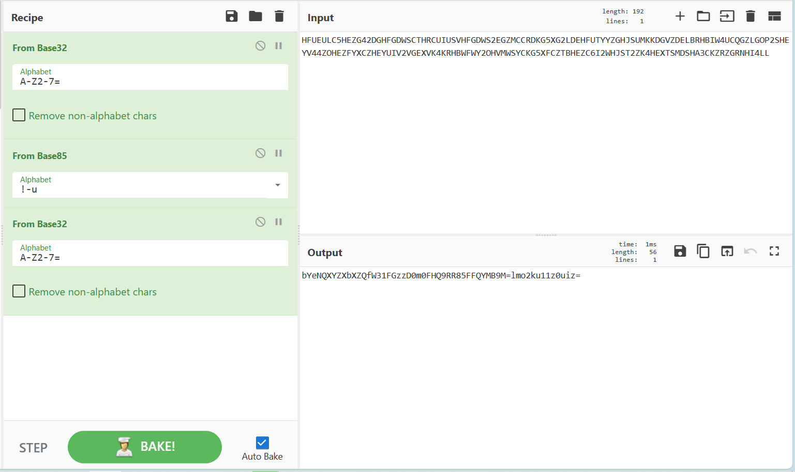

# MoeCTF 2023 Misc Official WP

出题人（按字典序）：Koito Coco, Littlebean, ZeroAurora

## Misc 入门指北 / 50

出题人：Littlebean & ZeroAurora

题目路径：[intro](../Challenges/Misc/intro/)

非常简单的 Base64 解码。点击即送：`moectf{h@v3_fun_@t_m15c_!}`

## 打不开的图片 1 / 100

出题人：Littlebean

题目路径：[打不开的图片1](../Challenges/Misc/打不开的图片1/)

用进制编辑器打开“flag”文件


发现有JFIF和Exif等比较明显的JPG格式的特征（也可以通过文件尾判断）

但是发现缺少了文件开始字节：FF D8

补充后保存，并将后缀改为JPG


成功打开图片

在属性里看到


赛博橱子梭哈


moectf{XDU_i5_v3ry_6e@u2ifu1}

## 打不开的图片 2 / 100

出题人：Littlebean

题目路径：[打不开的图片2](../Challenges/Misc/打不开的图片2/)

发现图片打不开


丢进010看看


发现没有JPG常见的jfif、exif块，而是多了IHDR块，结合题目提示：牛头不对马嘴，猜测出题人给的假后缀和假文件头，这个实际上为png文件（也可以根据文件尾判断）

png文件头为89504E470D0A1A0A0000000D59484452

修改后保存并更改后缀


## 狗子(1) 普通的猫 / 100

出题人：ZeroAurora

题目路径：[meow](../Challenges/Misc/meow/)

是的，这是出题人编的一套题。这是本人的一点点私心，当然还有对某 H 比赛和某 G 比赛的拙劣模仿，希望大家理解。

Hex 编辑器教程题，拉到文件最后就可以得到：`moectf{eeeez_f1ag_as_A_G1ft!}`。

当然你也完全可以不用 Hex 编辑器，毕竟这串 Flag 就是个 ASCII 字符串，用记事本打开看也不是不行。如果你知道 Linux 的话，你当然也可以用 cat：`cat meow.wav`，是不是更切合题目了呢？

另外，“狗子”真的只是一只猫。这个录音真的是狗子在叫。

## building_near_lake / 150

出题人：Koito Coco feat. [Sherkey](https://github.com/SherkeyXD/) & ZeroAurora

题目路径：[building_near_lake](../Challenges/Misc/building_near_lake/)

简单的社工题，看图片上面可以看到立排上的 **XMU** （镜像的） 和楼门口的 **图书馆**，可以推断是厦门大学的图书馆。

**但是厦门大学有好几个校区和好几个图书馆（**，所以逐一比较，最后确定是翔安校区的图书馆，用地图坐标选取工具，在图书馆和湖之间选择一个合适的坐标即可

查看图片的exif信息可以看到手机型号，直接google搜一下就可以找到手机的发布会日期

在这里额外感谢厦门大学的好朋友 Sherkey 为我们提供了这道的图片。

## 尊嘟假嘟？ / 150

出题人：Koito Coco

题目路径：[zdjd](../Challenges/Misc/zdjd/)

直接Google搜就可以搜到 https://zdjd.vercel.app/

可以得到
```
cipher: rY5Ah8BtsYYatLEPu8YCPU22Gr5PQt8YGDKkvb4bk3D4JJeEe5kgCpoEqgRzsM7m9d8jEtE3LUoKpULQnMcuAunU1gtpzC5kSUxFctFTNCMZVHLHZNCo5akzKMRY5bbyBP7RNUeGDEYoUc
key: the tailing 8 bytes of hash of "zundujiadu?" which begin with b6091904cdfb
iv: the end 8 bytes of hash of "dududu?" which begin with 272bf1da2207

hint1: how do Bitcoin addresses encode?
hint2: the name of cryptosystem is "bl****sh"
```

hint1是base58 hint2是blowfish

先用cyberchef把base58变成hex，方便导入python脚本

```python
from hashlib import sha256
key = sha256(b"zundujiadu?").digest()[-8:]
iv = sha256(b"dududu?").digest()[-8:]
c = 0xc2c83b1167883c5f9684d2fbbedc597be7811337d704e6ae6d800a9f99650a7ccf33576302227e6463235de0654f4c23b41b917f79b849a8bf95116b62c459cff33a039d7c2c70020545261375800a78a79af5278e8515e2a0822af0719572eff6a88e129492ca21
from Crypto.Cipher.Blowfish import *
b = new(key,MODE_CBC,iv).decrypt(c.to_bytes(c.bit_length()//8,"big"))
b.rstrip(bytes([b[-1]]))
```

脚本得到`b'bW9lY3Rme3dvd195b3VfYVJlX3RoZV9tYXN0ZVJfb2ZfWnVuZHVqaWFkdV85MldQSUJ1bmc5MldQSUJ1bmc5P1dQSUJ1bmd9'`

丢回cyberchef，发现是base64，解码得到flag

## 烫烫烫 / 150

出题人：Koito Coco

题目路径：[unicode](../Challenges/Misc/unicode/)

utf7的独特编码方式，直接cyberchef得到如下内容（

```
这是你的flag：

a9736d8ad21107398b73324694cbcd11f66e3befe67016def21dcaa9ab143bc4405be596245361f98db6a0047b4be78ede40864eb988d8a4999cdcb31592fd42c7b73df3b492403c9a379a9ff5e81262

但是flag用AES加密了，key是下面这行字的sha256（hash值的开头是b34edc782d68fda34dc23329）

所以说，codepage真的很重要啊（
```
计算hash得到key: b34edc782d68fda34dc2332967273b0f0900a0ebd0dcec48467851bc6117bad1

说是aes，但是因为没有iv，所以用ecb解密，即可得到flag

## 狗子(2) 照片 / 150

出题人：ZeroAurora

题目路径：[LSB](../Challenges/Misc/LSB/)

考察最低显著位的相关知识。但是很显然，直到上题之后我才发现自己出难了。

大家最常使用的图片分析工具是 StegSolve，其中就有对 LSB 提取的支持。相信大家一定是从 [这里](https://ctf-wiki.org/misc/picture/png/#lsb) 了解到的。但是 StegSolve 有一个致命的问题：提取 LSB 的时候，Alpha 层总是被优先提取，也就是默认情况下，会按照 ARGB 的顺序提取最低位。但是本题使用的 [这个工具](https://github.com/ragibson/Steganography) 会使用 RGBA 的顺序。因此，许多师傅在做这道题的时候被卡住了很久，在这里向大家磕头了。

解题方法上，可以选择嗯找工具，但是就算找到了上面这个工具，没有正确的参数也是跑不出来的（该工具默认提取每像素的最低两位）。下面是使用这个工具所需的命令：

```
stegolsb steglsb -r -n 1 -i ./bincat_hacked.png -o a.txt
```

比赛过程中，部分师傅反馈，使用 [zsteg](https://github.com/zed-0xff/zsteg) 可以解出本题，但是最新版本的 zsteg 会有一个 [爆栈的 bug](https://github.com/zed-0xff/zsteg/issues/30)，据反馈使用次新版本或是按照 issue 内的解决方法均可正常工作。部分师傅选择通过裁剪 PNG 尺寸，只保留最上方一部分来减小大小，进而避免爆栈的方式，也是可行的。

但最简单的方法，其实是一个我们经常使用的工具：[CyberChef](https://gchq.github.io/CyberChef/#recipe=Extract_LSB('R','G','B','A','Row',0))。

```
Extract_LSB('R','G','B','A','Row',0)
```

最终的 Flag：`moectf{D0ggy_H1dd3n_1n_Pho7o_With_LSB!}`

## base 乐队 / 150

出题人：Littlebean

题目路径：[base乐队](../Challenges/Misc/base乐队/)

这题给大伙磕一个，说是base乐队但是倒数第二步放了个古典加密，题目还忘记给提示了，我自锤



经过三次base变换后发现有两个等号，但是不在一起，猜测是栅栏

注意栅栏有标椎型和w型两种这里用的是标准型


将等号放在一起后再丢进赛博橱子


## 奇怪的压缩包 / 200

出题人：Littlebean

题目路径：[奇怪的压缩包](../Challenges/Misc/奇怪的压缩包/)


打开后发现是PPT，改后缀打开PPT（对PPT文件结构熟悉的老手也可以直接在XML里边慢慢找flag片段）


打开后提示文稿有批注，先把批注打开说不定等会就用到了

第二页PPT全选后发现右上角有个空白文本框，选中文本框发现有内容，更改一下字体颜色


第三页PPT右边有批注


第四页PPT把妙蛙种子移开


第五页PPT选择窗格发现有一个被隐藏的内容


恢复后得到


将片段拼起来

moectf{2ip_?_n0_i4_pp4x!}

## 机位查询 / 200

出题人：Littlebean

题目路径：[机位查询](../Challenges/Misc/机位查询/)

图1有个很明显的南宁站


根据南宁站和便捷酒店大致判断出位置，应该在这个圈附近


再根据图片左下角的楼层数判断，拍摄点的楼层很高，用实景地图看到最高的楼为嘉士摩根国际


这题我已经强调了是楼的名字，但是很多师傅提交的却是酒店名，但是酒店只是楼的一部分

图2


图二中的中山路美食街现在已经被拆除了，在部分地图上已经搜索不到，但是通过一些浏览器或者社交媒体还是能查询到大体的位置

根据实景地图依旧能看到中山路美食街


在对面唯一的高楼为百盛步行街广场（百盛大楼）


图3我保留了GPS信息

可以直接利用工具定位


有的手机也可以直接查看


## 狗子(3) 寝室 / 200

出题人：ZeroAurora feat. Koito Coco

题目路径：[ziploop](../Challenges/Misc/ziploop/)

本题致敬 2022 级西电网安实验班分班考试。当时可可对我吐槽考试中的压缩包套娃，于是和他计划通出了一道层数更多的。

这里附上本人的 [解法](../Challenges/Misc/ziploop/solution/solution.py)，需要注意 PATH 里要有对应工具。

Flag: `moectf{Ca7_s133p1ng_und3r_zip_5hell5}`

## 照片冲洗 / 300

出题人：Littlebean

题目路径：[照片冲洗](../Challenges/Misc/照片冲洗/)

根据题目的提示可以猜测解题步骤为图片分离后解盲水印


用打开后搜索AE426082（png的文件尾）

找到第一张图片的文件尾，可以发现第二张图片的文件头被删掉了，将其分离出来并补充文件头

将得到的两张图片放入盲水印脚本（盲水印的脚本有很多个，本题使用的是py3的频域盲水印）


然后得到


## 狗子(4) 故乡话 / 300

出题人：Koito Coco feat. ZeroAurora

题目路径：[pyplot](../Challenges/Misc/pyplot/)

True 与 False 成矩阵排列，可绘制点阵图，然后读图结合题目可知，这是 Minecraft 中的附魔台可见的 [标准银河字母](https://zh.minecraft.wiki/w/%E9%99%84%E9%AD%94%E5%8F%B0#%E7%AC%A6%E6%96%87)。看图写话即可作答。

上述的题目路径中附带了一个绘图用的 Jupyter Notebook。

Flag: moectf{dontanswer}

## magnet_network / 500

出题人：Koito Coco

题目路径：[magnet_network](../Challenges/Misc/magnet_network/)

首先需要解析这个种子文件，这里直接上脚本

```python
# 直接找的 https://blog.csdn.net/m0_50910065/article/details/126951147
import json
 
# 二话不说，先读取
file="segments.torrent"
 
if file[0] in ["'",'"']:
    file=file[1:-1]
f=open(file,'rb')
s=f.read()
f.close()
 
# %%
# 由基本数据类型得到以下一些标识符：
sign_num = b'0123456789' # 表示数字
sign_str = b':' # 字符串
sign_int = b'i' # 整数
sign_list= b'l' # 列表
sign_dict= b'd' # 字典
sign_end = b'e' # 整数和列表和字典的结尾
 
 
# %%
# 提取字符串
 
# 这个函数用来获取字符串的长度
def len_str(s,i, start_safe=0):
    '''### 获取字符串/字节串的长度
    #### input:
    - s: 整体的字符串
    - i: 标识符 ":" 的位置
    - start_safe: 从此位置开始往后计算，此前的屏蔽掉
    #### return: 字符串的长度
    '''
    num=b''
    j=0
    while s[i-j-1:i-j] in sign_num and i-j>start_safe:
        num = s[i-j-1:i-j]+num
        j+=1
 
    if len(num)>0:
        return int(num)
    else:
        return 0
 
# %%
# 将里面的字符串全部提取
# 将所有的字符串全部转化为指定的字符：s
i=0
s_del_str = s
 
length_del=0
end_str=0
len_str_lis=[]
str_lis = []
 
while i<len(s):
    if s[i:i+1]==sign_str:
        length=len_str(s,i, start_safe=end_str)
        len_str_lis.append(length)
 
        if length>0:
            # print(s[i+1:i+length+1])
            str_lis.append(s[i+1:i+length+1])
            s_del_str = s_del_str[:i-len(str(length))-length_del]+ b's' +s_del_str[i+1+length-length_del:]
            length_del += len(str(length))+length
            end_str = i+length+1
        
        i+=length
    i+=1
 
 
# %%
# 提取数字
def len_int(s,i):
    j=1
    while s[i+j:i+j+1] in sign_num and i+j<len(s):
        j+=1
 
    return j-1
 
i=0
s_del_int=s_del_str
length_del_int=0
int_lis=[]
 
while i<len(s_del_str):
    if s_del_str[i:i+1] == sign_int:
        length=len_int(s_del_str,i)
        # print(s_del_str[i+1:i+1+length])
        int_lis.append(int(s_del_str[i+1:i+1+length]))
        s_del_int = s_del_int[:i-length_del_int]+ b'i' +s_del_int[i+2+length-length_del_int:]
 
        i+=length
        length_del_int+=length+1
    i+=1
 
 
# %%
# 处理列表和字典
s_list_dict=s_del_int.replace(b'l',b'[').replace(b'd',b'{')
s_del_list_dict=s_list_dict
 
lis_sign_near=[]
i=0
while i<len(s_list_dict):
    if s_list_dict[i:i+1]==b'[':
        lis_sign_near.append(b']')
    elif s_list_dict[i:i+1]==b'{':
        lis_sign_near.append(b'}')
    
    elif s_list_dict[i:i+1]==b'e':
        s_del_list_dict=s_del_list_dict[:i]+lis_sign_near[-1]+s_del_list_dict[i+1:]
        lis_sign_near=lis_sign_near[:-1]
    
    i+=1
 
s_del_list_dict = s_del_list_dict.replace(b'[s]',b's')
 
# %%
# 相当难搞
i=0
j=0
sign_lis=False
k_lis=[]
 
data=s_del_list_dict
lis_sign_near=[]
while i<len(s_del_list_dict):
    if s_del_list_dict[i:i+1] in [b's',b'i'] and s_del_list_dict[i+1:i+2] not in [b']',b'}']:
        j+=1
        if not sign_lis:
            k_lis[-1]+=1
            if k_lis[-1]%2==1:
                data=data[:i+j]+b':'+data[i+j:]
            else:
                data=data[:i+j]+b','+data[i+j:]
        else:
            data=data[:i+j]+b','+data[i+j:]
    
    elif s_del_list_dict[i:i+1] in [b'[',b'{']:
        lis_sign_near.append(s_del_list_dict[i:i+1])
        if s_del_list_dict[i:i+1]==b'{':
            k_lis.append(0)
            
    elif s_del_list_dict[i:i+1] in [b']',b'}']:
        lis_sign_near=lis_sign_near[:-1]
        j+=1
        data=data[:i+j]+b','+data[i+j:]
 
        if s_del_list_dict[i:i+1]==b'}' and len(k_lis)>0:
            k_lis=k_lis[:-1]
        
        if len(lis_sign_near)>0:
            if lis_sign_near[-1]==b'[':
                sign_lis=True
            else:
                sign_lis=False
                k_lis[-1]+=1
 
    if len(lis_sign_near)>0:
        if lis_sign_near[-1]==b'[':
            sign_lis=True
        else:
            sign_lis=False
    
    i+=1
    
 
# 最后填充数据
 
data=data.replace(b',]',b']').replace(b',}',b'}')[:-1]
data=data.decode('utf8').replace('s','"temp_str"').replace('i','"temp_int"')
 
# %%
# 填充数据
for i in str_lis:
    if len(i)<100:
        try:
            data=data.replace('temp_str',str(i.decode()), 1)
        except:
            data=data.replace('temp_str',"can't decode", 1)
    else:
        data=data.replace('temp_str','too long', 1)
 
for i in int_lis:
    data=data.replace('temp_int',str(i), 1)
 
 
# 一些意外情况
while '""' in data:
    data=data.replace('""','"')
while '\t' in data:
    data=data.replace('\t','-')
while '\n' in data:
    data=data.replace('\n','-')
 
# %%
# 输出为json
# 这里输出为一种肉眼可见的方便的格式(json)
# 更人性化的输出后续在此基础上自己动手修改
 
try:
    result_json = json.loads(data) # except，主要就是上面那些意外情况
    if 'info' in result_json:
        print('\ninfo:')
        print(json.dumps(result_json['info'], indent=4, ensure_ascii=False))
 
    f=open(file.replace('.torrent','.json'),'w', encoding='utf8')
    f.write(json.dumps(result_json, indent=4, ensure_ascii=False))
    f.close()
 
    input('\n  读取成功\n\n详细信息已保存至同名json文件中')
 
except:
    input('\n  读取失败：字符串转为字典的时候出错\n\n赶紧滚去修bug')
```

解析得到一个json

```json
{"comment": "too long","created by": "qBittorrent v4.5.4.10","creation date": "1691855086","info": {"files": [{"length": "4","path": "1"},{"attr": "p","length": "16380","path": [".pad","0"]},{"length": "4","path": "3"},{"attr": "p","length": "16380","path": [".pad","1"]},{"length": "4","path": "5"},{"attr": "p","length": "16380","path": [".pad","2"]},{"length": "4","path": "2"},{"attr": "p","length": "16380","path": [".pad","3"]},{"length": "4","path": "6"},{"attr": "p","length": "16380","path": [".pad","4"]},{"length": "4","path": "4"}],"name": "segments","piece length": "16384","pieces": "too long"}}
```

可以发现，6个文件都是4字节的，但是前5个文件有padding，padding部分全部为0

手动提取出6个pieces的hash

```
3acad96ee53545f8ad3c419c5b1965bea234cc6a
b339e2547e1bb5c1e56c2aceab1f7cf5af93d13d
65131dba750fdcb715e3235107041de9c79671ae
d3ba653b9d29544b623902aa07074492793c7ad4
4dd6e892d925a7411cb1677b8b5d8fec6d9308ac
cc83047e9ae392e02b5044283c89f16dc26f328e
```

写脚本爆破即可

```python
from hashlib import sha1
from itertools import product
chars = "0123456789abcdefghijklmnopqrstuvwxyzABCDEFGHIJKLMNOPQRSTUVWXYZ@!_?"
for t in [
"3acad96ee53545f8ad3c419c5b1965bea234cc6a",
"b339e2547e1bb5c1e56c2aceab1f7cf5af93d13d",
"65131dba750fdcb715e3235107041de9c79671ae",
"d3ba653b9d29544b623902aa07074492793c7ad4",
"4dd6e892d925a7411cb1677b8b5d8fec6d9308ac",
]:
    for c in product(chars,repeat=4):
        p = "".join(c).encode() + b"\0"*16380
        h = sha1(p).hexdigest()
        if h == t:
            print(p)
            break
for c in product(chars,repeat=4):
    p = "".join(c).encode()
    h = sha1(p).hexdigest()
    if h == "cc83047e9ae392e02b5044283c89f16dc26f328e":
        print(p)
        break
```

最后再调整一下顺序，即可得到flag

## weird_package / 500

出题人：Koito Coco

题目路径：[weird_package](../Challenges/Misc/weird_package/)

~~被狠狠非预期了呜呜呜~~

非预期：用7zip打开，会自动寻找有效的文件payload，可以读出几个文件

预期：用imhex或者010 editor等hex编辑器打开，发现部分元数据被修改，手动进行修复或手动复制出文件的payload

然后发现这些文件是base64编码的（根据末尾的`=`可以判断），但是解码之后是一团不可读的二进制，计算信息熵也非常大，可以判断这是**加密**或者**压缩**后的数据，因为没有给出加密方式和密钥，所以先尝试解压，解压后发现是个合法的base64字符串，解码得到flag

```
# CyberChef
From_Base64('A-Za-z0-9+/=',true,false)
Raw_Inflate(0,0,'Adaptive',false,false)
From_Base64('A-Za-z0-9+/=',true,false)
```

注：有九个文件，但是只有一个是flag，所以都尝试一下吧（

## 狗子(5) 毛线球 / 500

出题人：ZeroAurora

题目路径：[escaping_cat](../Challenges/Misc/escapint_cat/)

一道个人非常满意的题目。先看题面：

```python
from time import sleep
from os import environ, system, popen
from random import randint
from sys import argv

# The cat spawns many processes so you won't find him!
for _ in range(randint(100, 1000)):
    system("true")

if argv[1] != "flag{HIDDEN}":
    # The cat spawns himself again to hide the flag!
    environ["CATSFLAG"] = argv[1]
    popen(f"python {__file__} flag{{HIDDEN}}")
else:
    # After securely hiding himself, he sleeps before escaping to his universe...
    # Note that Doggy starts hiding exactly when the environment starts.
    # So if Doggy escapes in 5 mins, you will HAVE TO RESET your environment!
    sleep(300)
    exit()
```

这段代码非常短小，删除注释后仅有 11 行。其表达出来的内容也十分简单易懂：

1. 随机 100~1000 次运行 `/bin/true`
2. 如果命令行传递进的参数不被”隐藏“，则：
    1. 设置一个值为参数的环境变量
    2. 执行自身，”隐藏“参数
    3. 自身结束执行
3. 如果命令行传递进的参数是”隐藏“的，则等待 300s 后退出，答题者必须重启环境。

根据代码内容我们可以知道，被隐藏的内容就是 Flag。

回到提供的环境来，这个模拟 shell 除了彩蛋提供且仅提供了一个工具：cat。其功能是打印一个文件的内容到屏幕上。这让我们很容易想到类 Unix 操作系统的一个设计特点：[万物皆文件](https://en.wikipedia.org/wiki/Everything_is_a_file)。既然我们需要的东西是一个进程的环境变量，那我们能不能通过一个文件读取到呢？

答案显然是可以的，那就是 [`/proc` 虚拟文件系统](https://www.kernel.org/doc/html/latest/filesystems/proc.html)。关于这一文件系统的功能多样这里不再赘述，只陈述关键点：`/proc/{pid}/environ` 是 PID 所指代进程的环境变量。这也照应上了为什么前面需要随机次数地运行 `/bin/true`：一个容器内的初始 PID 是从 1 开始的，直接设置环境变量就失去了本题考查的另一重要方面：pwntools 脚本编写。

在这里附上出题人的解题代码：

```python
import pwn

r = pwn.connect("localhost", 44017)

r.recvuntil(b"(yourcat)")
for i in range(100, 1100):
    print(f"trying pid {i}")
    r.sendline(f"cat /proc/{i}/environ")
    recv = r.recvuntil("(yourcat)").decode()
    if "CATSFLAG" in recv:
        print(recv)
        break
r.close()
```

## 狗子(6) 星尘之猫 / 500

出题人：Koito Coco

题目路径：[pyreader](../Challenges/Misc/pyreader/)

一个简单的 pyjail（批注：实际上并不是传统意义的 Pyjail。传统意义上 Pyjail 是利用 Python 的特性 RCE，但本体仅利用 Python 的特性读取文件。）

核心部分代码如下

```python
pattern = re.compile(r"(?:read)|(?:pattern)|(?:write)|(?:dir)|(?:vars)|(?:locals)|(?:globals)|(?:attr)|(?:sys)|(?:import)|(?:eval)|(?:exec)|(?:input)|(?:os)|(?:help)|(?:breakpoint)|(?:[\.\\_=])|[^\x00-\xff]")
while True:
    try:
        s = self.recv(">> ")
        if len(s) > 35 or pattern.search(s):
            self.send("<< [ === ACCESS DENIED === ]")
            continue
        self.send(f"<< {eval(s)}")
    except KeyboardInterrupt:
        break
    except:
        self.send("<< [ === !!!ERROR!!! === ]")
```

应该是不能rce得到shell的，所以尝试直接读取文件，发现`open`函数没有被ban，但是`read`函数是ban掉的

这里涉及到一个小知识：`open`函数返回的是一个可迭代对象，可以直接展开成列表

因此得到payload

```python
[*open("flag"+chr(46)+"txt")]
```
