# MoeCTF2023 Re Writeup
Reverse出题组：dr3,云之君,浮小云


## 逆向工程入门指北

ida反编译就能看到falg。或者按照指北里仔细数数，填入正确数字也可以得到flag

## base_64

>  [pyc反编译](https://tool.lu/pyc/)把`base_64.pyc`反编译得到python代码

```
#!/usr/bin/env python
# visit https://tool.lu/pyc/ for more information
# Version: Python 3.7

import base64
from string import *
str1 = 'yD9oB3Inv3YAB19YynIuJnUaAGB0um0='
string1 = 'ZYXWVUTSRQPONMLKJIHGFEDCBAzyxwvutsrqponmlkjihgfedcba0123456789+/'
string2 = 'ABCDEFGHIJKLMNOPQRSTUVWXYZabcdefghijklmnopqrstuvwxyz0123456789+/'
flag = input('welcome to moectf\ninput your flag and I wiil check it:')
enc_flag = base64.b64encode(flag.encode()).decode()
enc_flag = enc_flag.translate(str.maketrans(string2, string1))
if enc_flag == str1:
    print('good job!!!!')
else:
    print('something wrong???')
    exit(0)
```

这里反编译之后逻辑看的很清楚

换表base64即可

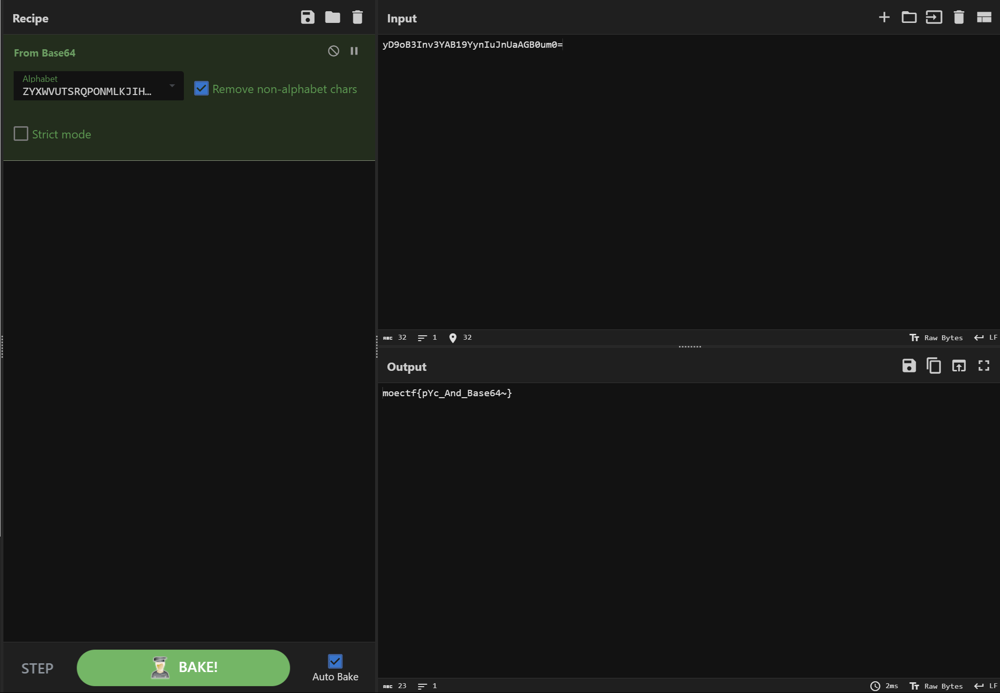

## UPX!

UPX是一种压缩壳，用来压缩程序大小，在运行的时候会自解压，逆向的时候要先脱壳再逆

用查壳机查一下壳

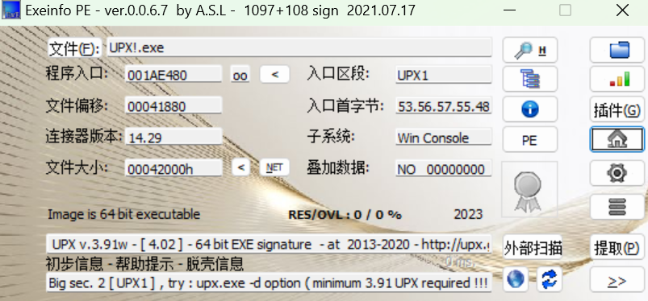

upx -d upx!.exe脱壳

里面逻辑很简单，一个异或之后get flag!

## EQUATION

拖进ida,稍微改一下ida识别错误的flag长度

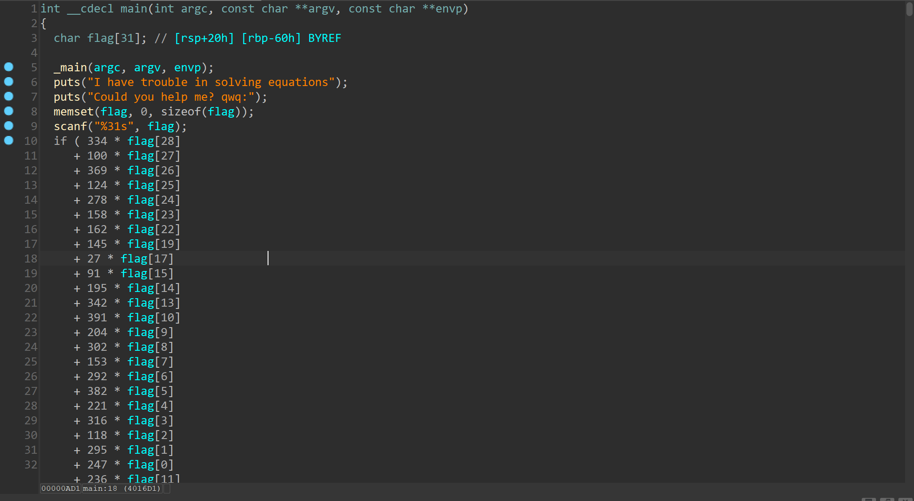
方程复制下来，写z3脚本处理!=号的时候会发现，只有30个方程组，但是题目里告诉flag的格式是moectf{},所以还是可以解的

~~其实是出题人失误了，少复制了一个方程上去，给大伙增加了不必要的难度（90度鞠躬~~

最后写个脚本出来

```
from z3 import *
s=Solver()
flag = [Int("flag[%d]"%i) for i in range(31)]
x=[flag[0]*247+flag[1]*295+flag[2]*118+flag[3]*316+flag[4]*221+flag[5]*382+flag[6]*292+flag[7]*153+flag[8]*302+flag[9]*204+flag[10]*391+flag[11]*236+flag[12]*27+flag[13]*342+flag[14]*195+flag[15]*91+flag[16]*361+flag[17]*27+flag[18]*81+flag[19]*145+flag[20]*105+flag[21]*64+flag[22]*162+flag[23]*158+flag[24]*278+flag[25]*124+flag[26]*369+flag[27]*100+flag[28]*334+flag[29]*67+flag[30]*41==596022,flag[0]*235+flag[1]*316+flag[2]*378+flag[3]*329+flag[4]*141+flag[5]*323+flag[6]*59+flag[7]*37+flag[8]*357+flag[9]*262+flag[10]*44+flag[11]*347+flag[12]*68+flag[13]*253+flag[14]*111+flag[15]*341+flag[16]*264+flag[17]*73+flag[18]*333+flag[19]*122+flag[20]*211+flag[21]*303+flag[22]*294+flag[23]*235+flag[24]*299+flag[25]*67+flag[26]*312+flag[27]*269+flag[28]*338+flag[29]*371+flag[30]*126==634009,flag[0]*236+flag[1]*361+flag[2]*90+flag[3]*386+flag[4]*112+flag[5]*297+flag[6]*373+flag[7]*377+flag[8]*229+flag[9]*270+flag[10]*272+flag[11]*124+flag[12]*345+flag[13]*221+flag[14]*386+flag[15]*73+flag[16]*306+flag[17]*377+flag[18]*330+flag[19]*304+flag[20]*58+flag[21]*239+flag[22]*315+flag[23]*33+flag[24]*141+flag[25]*129+flag[26]*82+flag[27]*118+flag[28]*338+flag[29]*337+flag[30]*123==685705,flag[0]*13+flag[1]*230+flag[2]*306+flag[3]*146+flag[4]*22+flag[5]*188+flag[6]*221+flag[7]*158+flag[8]*209+flag[9]*109+flag[10]*145+flag[11]*383+flag[12]*153+flag[13]*287+flag[14]*257+flag[15]*137+flag[16]*7+flag[17]*191+flag[18]*307+flag[19]*230+flag[20]*366+flag[21]*124+flag[22]*141+flag[23]*350+flag[24]*150+flag[25]*52+flag[26]*31+flag[27]*374+flag[28]*55+flag[29]*367+flag[30]*355==557696,flag[0]*338+flag[1]*18+flag[2]*399+flag[3]*53+flag[4]*334+flag[5]*281+flag[6]*84+flag[7]*68+flag[8]*399+flag[9]*148+flag[10]*21+flag[11]*196+flag[12]*220+flag[13]*174+flag[14]*36+flag[15]*291+flag[16]*350+flag[17]*2+flag[18]*41+flag[19]*395+flag[20]*83+flag[21]*348+flag[22]*137+flag[23]*24+flag[24]*359+flag[25]*210+flag[26]*55+flag[27]*362+flag[28]*191+flag[29]*100+flag[30]*368==538535,flag[0]*395+flag[1]*302+flag[2]*189+flag[3]*209+flag[4]*244+flag[5]*208+flag[6]*224+flag[7]*303+flag[8]*398+flag[9]*356+flag[10]*119+flag[11]*49+flag[12]*200+flag[13]*251+flag[14]*135+flag[15]*16+flag[16]*309+flag[17]*314+flag[18]*13+flag[19]*217+flag[20]*310+flag[21]*21+flag[22]*207+flag[23]*83+flag[24]*248+flag[25]*93+flag[26]*128+flag[27]*67+flag[28]*127+flag[29]*188+flag[30]*100==580384,flag[0]*88+flag[1]*215+flag[2]*191+flag[3]*358+flag[4]*57+flag[5]*190+flag[6]*179+flag[7]*38+flag[8]*292+flag[9]*138+flag[10]*22+flag[11]*72+flag[12]*357+flag[13]*9+flag[14]*398+flag[15]*389+flag[16]*81+flag[17]*398+flag[18]*196+flag[19]*180+flag[20]*218+flag[21]*258+flag[22]*0+flag[23]*248+flag[24]*303+flag[25]*114+flag[26]*387+flag[27]*123+flag[28]*343+flag[29]*293+flag[30]*85==529847,flag[0]*203+flag[1]*110+flag[2]*200+flag[3]*312+flag[4]*275+flag[5]*389+flag[6]*292+flag[7]*76+flag[8]*357+flag[9]*99+flag[10]*21+flag[11]*251+flag[12]*322+flag[13]*398+flag[14]*281+flag[15]*216+flag[16]*244+flag[17]*142+flag[18]*269+flag[19]*33+flag[20]*75+flag[21]*86+flag[22]*362+flag[23]*246+flag[24]*328+flag[25]*55+flag[26]*272+flag[27]*234+flag[28]*202+flag[29]*311+flag[30]*356==631652,flag[0]*312+flag[1]*241+flag[2]*149+flag[3]*234+flag[4]*155+flag[5]*225+flag[6]*292+flag[7]*368+flag[8]*129+flag[9]*376+flag[10]*389+flag[11]*121+flag[12]*154+flag[13]*169+flag[14]*132+flag[15]*232+flag[16]*157+flag[17]*217+flag[18]*226+flag[19]*288+flag[20]*285+flag[21]*182+flag[22]*185+flag[23]*202+flag[24]*23+flag[25]*55+flag[26]*189+flag[27]*201+flag[28]*288+flag[29]*261+flag[30]*69==614840,flag[0]*313+flag[1]*263+flag[2]*186+flag[3]*271+flag[4]*116+flag[5]*101+flag[6]*114+flag[7]*134+flag[8]*55+flag[9]*282+flag[10]*88+flag[11]*105+flag[12]*286+flag[13]*16+flag[14]*97+flag[15]*395+flag[16]*193+flag[17]*149+flag[18]*266+flag[19]*237+flag[20]*149+flag[21]*129+flag[22]*287+flag[23]*396+flag[24]*279+flag[25]*23+flag[26]*139+flag[27]*153+flag[28]*118+flag[29]*60+flag[30]*145==510398,flag[0]*310+flag[1]*154+flag[2]*24+flag[3]*53+flag[4]*39+flag[5]*292+flag[6]*59+flag[7]*44+flag[8]*66+flag[9]*373+flag[10]*50+flag[11]*335+flag[12]*161+flag[13]*329+flag[14]*222+flag[15]*396+flag[16]*144+flag[17]*81+flag[18]*382+flag[19]*46+flag[20]*358+flag[21]*321+flag[22]*156+flag[23]*313+flag[24]*145+flag[25]*232+flag[26]*8+flag[27]*112+flag[28]*53+flag[29]*385+flag[30]*355==558740,flag[0]*163+flag[1]*270+flag[2]*173+flag[3]*177+flag[4]*318+flag[5]*297+flag[6]*287+flag[7]*70+flag[8]*233+flag[9]*159+flag[10]*372+flag[11]*274+flag[12]*134+flag[13]*224+flag[14]*114+flag[15]*14+flag[16]*77+flag[17]*25+flag[18]*202+flag[19]*191+flag[20]*358+flag[21]*305+flag[22]*387+flag[23]*18+flag[24]*168+flag[25]*22+flag[26]*74+flag[27]*313+flag[28]*386+flag[29]*249+flag[30]*345==592365,flag[0]*360+flag[1]*387+flag[2]*300+flag[3]*264+flag[4]*86+flag[5]*22+flag[6]*142+flag[7]*92+flag[8]*231+flag[9]*325+flag[10]*393+flag[11]*305+flag[12]*232+flag[13]*203+flag[14]*181+flag[15]*261+flag[16]*372+flag[17]*223+flag[18]*324+flag[19]*343+flag[20]*225+flag[21]*127+flag[22]*99+flag[23]*2+flag[24]*27+flag[25]*13+flag[26]*80+flag[27]*302+flag[28]*385+flag[29]*392+flag[30]*268==619574,flag[0]*319+flag[1]*64+flag[2]*218+flag[3]*284+flag[4]*251+flag[5]*193+flag[6]*278+flag[7]*66+flag[8]*171+flag[9]*302+flag[10]*258+flag[11]*94+flag[12]*176+flag[13]*125+flag[14]*19+flag[15]*24+flag[16]*295+flag[17]*94+flag[18]*140+flag[19]*150+flag[20]*85+flag[21]*267+flag[22]*96+flag[23]*160+flag[24]*111+flag[25]*33+flag[26]*235+flag[27]*370+flag[28]*270+flag[29]*174+flag[30]*13==480557,flag[0]*196+flag[1]*123+flag[2]*162+flag[3]*102+flag[4]*120+flag[5]*223+flag[6]*328+flag[7]*29+flag[8]*27+flag[9]*225+flag[10]*74+flag[11]*377+flag[12]*287+flag[13]*365+flag[14]*286+flag[15]*282+flag[16]*309+flag[17]*364+flag[18]*358+flag[19]*43+flag[20]*227+flag[21]*376+flag[22]*315+flag[23]*170+flag[24]*357+flag[25]*210+flag[26]*326+flag[27]*260+flag[28]*87+flag[29]*0+flag[30]*352==666967,flag[0]*277+flag[1]*207+flag[2]*365+flag[3]*378+flag[4]*158+flag[5]*113+flag[6]*100+flag[7]*229+flag[8]*262+flag[9]*51+flag[10]*140+flag[11]*163+flag[12]*188+flag[13]*124+flag[14]*190+flag[15]*320+flag[16]*353+flag[17]*347+flag[18]*11+flag[19]*371+flag[20]*211+flag[21]*326+flag[22]*230+flag[23]*116+flag[24]*202+flag[25]*260+flag[26]*64+flag[27]*125+flag[28]*195+flag[29]*61+flag[30]*137==590534,flag[0]*157+flag[1]*26+flag[2]*16+flag[3]*156+flag[4]*85+flag[5]*23+flag[6]*150+flag[7]*72+flag[8]*356+flag[9]*35+flag[10]*304+flag[11]*311+flag[12]*140+flag[13]*205+flag[14]*184+flag[15]*193+flag[16]*28+flag[17]*60+flag[18]*50+flag[19]*201+flag[20]*87+flag[21]*313+flag[22]*308+flag[23]*77+flag[24]*324+flag[25]*157+flag[26]*360+flag[27]*303+flag[28]*39+flag[29]*58+flag[30]*0==429108,flag[0]*132+flag[1]*369+flag[2]*257+flag[3]*172+flag[4]*254+flag[5]*134+flag[6]*384+flag[7]*162+flag[8]*53+flag[9]*255+flag[10]*296+flag[11]*132+flag[12]*159+flag[13]*165+flag[14]*229+flag[15]*129+flag[16]*23+flag[17]*41+flag[18]*385+flag[19]*296+flag[20]*317+flag[21]*112+flag[22]*17+flag[23]*222+flag[24]*96+flag[25]*161+flag[26]*269+flag[27]*71+flag[28]*137+flag[29]*157+flag[30]*126==563521,flag[0]*134+flag[1]*37+flag[2]*334+flag[3]*193+flag[4]*301+flag[5]*279+flag[6]*198+flag[7]*250+flag[8]*183+flag[9]*5+flag[10]*334+flag[11]*26+flag[12]*270+flag[13]*21+flag[14]*225+flag[15]*259+flag[16]*175+flag[17]*341+flag[18]*111+flag[19]*154+flag[20]*142+flag[21]*223+flag[22]*138+flag[23]*275+flag[24]*48+flag[25]*67+flag[26]*35+flag[27]*111+flag[28]*83+flag[29]*207+flag[30]*163==493999,flag[0]*112+flag[1]*132+flag[2]*217+flag[3]*210+flag[4]*18+flag[5]*72+flag[6]*75+flag[7]*113+flag[8]*40+flag[9]*273+flag[10]*296+flag[11]*43+flag[12]*152+flag[13]*278+flag[14]*24+flag[15]*77+flag[16]*11+flag[17]*262+flag[18]*342+flag[19]*55+flag[20]*255+flag[21]*241+flag[22]*13+flag[23]*300+flag[24]*281+flag[25]*148+flag[26]*162+flag[27]*105+flag[28]*176+flag[29]*393+flag[30]*356==470065,flag[0]*356+flag[1]*349+flag[2]*397+flag[3]*92+flag[4]*208+flag[5]*175+flag[6]*229+flag[7]*103+flag[8]*181+flag[9]*64+flag[10]*5+flag[11]*392+flag[12]*359+flag[13]*335+flag[14]*58+flag[15]*44+flag[16]*340+flag[17]*251+flag[18]*114+flag[19]*153+flag[20]*345+flag[21]*390+flag[22]*189+flag[23]*297+flag[24]*290+flag[25]*285+flag[26]*88+flag[27]*40+flag[28]*231+flag[29]*369+flag[30]*295==661276,flag[0]*21+flag[1]*103+flag[2]*204+flag[3]*247+flag[4]*287+flag[5]*170+flag[6]*298+flag[7]*386+flag[8]*75+flag[9]*84+flag[10]*27+flag[11]*28+flag[12]*270+flag[13]*159+flag[14]*192+flag[15]*1+flag[16]*224+flag[17]*392+flag[18]*213+flag[19]*283+flag[20]*215+flag[21]*77+flag[22]*201+flag[23]*374+flag[24]*213+flag[25]*40+flag[26]*129+flag[27]*341+flag[28]*67+flag[29]*27+flag[30]*361==555288,flag[0]*312+flag[1]*345+flag[2]*275+flag[3]*113+flag[4]*264+flag[5]*171+flag[6]*48+flag[7]*384+flag[8]*47+flag[9]*298+flag[10]*222+flag[11]*303+flag[12]*339+flag[13]*175+flag[14]*5+flag[15]*350+flag[16]*32+flag[17]*218+flag[18]*304+flag[19]*391+flag[20]*113+flag[21]*19+flag[22]*342+flag[23]*164+flag[24]*240+flag[25]*289+flag[26]*171+flag[27]*210+flag[28]*363+flag[29]*106+flag[30]*263==637650,flag[0]*28+flag[1]*365+flag[2]*15+flag[3]*169+flag[4]*0+flag[5]*327+flag[6]*23+flag[7]*303+flag[8]*301+flag[9]*163+flag[10]*170+flag[11]*287+flag[12]*352+flag[13]*72+flag[14]*332+flag[15]*323+flag[16]*1+flag[17]*270+flag[18]*318+flag[19]*308+flag[20]*45+flag[21]*140+flag[22]*65+flag[23]*344+flag[24]*289+flag[25]*385+flag[26]*119+flag[27]*62+flag[28]*169+flag[29]*278+flag[30]*346==572609,flag[0]*238+flag[1]*385+flag[2]*226+flag[3]*35+flag[4]*383+flag[5]*136+flag[6]*267+flag[7]*348+flag[8]*20+flag[9]*230+flag[10]*43+flag[11]*349+flag[12]*290+flag[13]*146+flag[14]*88+flag[15]*354+flag[16]*158+flag[17]*21+flag[18]*60+flag[19]*208+flag[20]*142+flag[21]*388+flag[22]*281+flag[23]*249+flag[24]*63+flag[25]*9+flag[26]*237+flag[27]*143+flag[28]*88+flag[29]*147+flag[30]*343==603481,flag[0]*173+flag[1]*206+flag[2]*26+flag[3]*272+flag[4]*348+flag[5]*396+flag[6]*142+flag[7]*313+flag[8]*75+flag[9]*142+flag[10]*364+flag[11]*315+flag[12]*184+flag[13]*296+flag[14]*149+flag[15]*201+flag[16]*355+flag[17]*225+flag[18]*211+flag[19]*326+flag[20]*118+flag[21]*155+flag[22]*144+flag[23]*366+flag[24]*257+flag[25]*159+flag[26]*323+flag[27]*148+flag[28]*24+flag[29]*29+flag[30]*253==664504,flag[0]*34+flag[1]*62+flag[2]*50+flag[3]*90+flag[4]*186+flag[5]*237+flag[6]*11+flag[7]*225+flag[8]*241+flag[9]*230+flag[10]*331+flag[11]*215+flag[12]*155+flag[13]*82+flag[14]*38+flag[15]*336+flag[16]*252+flag[17]*256+flag[18]*394+flag[19]*14+flag[20]*341+flag[21]*336+flag[22]*36+flag[23]*165+flag[24]*93+flag[25]*175+flag[26]*212+flag[27]*226+flag[28]*305+flag[29]*4+flag[30]*29==473092,flag[0]*102+flag[1]*109+flag[2]*43+flag[3]*76+flag[4]*303+flag[5]*64+flag[6]*161+flag[7]*155+flag[8]*50+flag[9]*58+flag[10]*118+flag[11]*280+flag[12]*0+flag[13]*28+flag[14]*309+flag[15]*213+flag[16]*317+flag[17]*324+flag[18]*148+flag[19]*256+flag[20]*303+flag[21]*234+flag[22]*303+flag[23]*254+flag[24]*233+flag[25]*62+flag[26]*8+flag[27]*252+flag[28]*216+flag[29]*353+flag[30]*93==497492,flag[0]*102+flag[1]*109+flag[2]*43+flag[3]*76+flag[4]*303+flag[5]*64+flag[6]*161+flag[7]*155+flag[8]*50+flag[9]*58+flag[10]*118+flag[11]*280+flag[12]*0+flag[13]*28+flag[14]*309+flag[15]*213+flag[16]*317+flag[17]*324+flag[18]*148+flag[19]*256+flag[20]*303+flag[21]*234+flag[22]*303+flag[23]*254+flag[24]*233+flag[25]*62+flag[26]*8+flag[27]*252+flag[28]*216+flag[29]*353+flag[30]*93==497492,flag[0]*234+flag[1]*261+flag[2]*10+flag[3]*237+flag[4]*338+flag[5]*322+flag[6]*389+flag[7]*298+flag[8]*113+flag[9]*285+flag[10]*392+flag[11]*104+flag[12]*181+flag[13]*345+flag[14]*3+flag[15]*371+flag[16]*219+flag[17]*208+flag[18]*259+flag[19]*278+flag[20]*169+flag[21]*231+flag[22]*123+flag[23]*202+flag[24]*220+flag[25]*274+flag[26]*53+flag[27]*82+flag[28]*148+flag[29]*89+flag[30]*361==659149,flag[0]*115+flag[1]*141+flag[2]*351+flag[3]*215+flag[4]*380+flag[5]*374+flag[6]*84+flag[7]*310+flag[8]*85+flag[9]*354+flag[10]*82+flag[11]*88+flag[12]*212+flag[13]*239+flag[14]*330+flag[15]*215+flag[16]*155+flag[17]*215+flag[18]*317+flag[19]*264+flag[20]*371+flag[21]*300+flag[22]*58+flag[23]*69+flag[24]*137+flag[25]*69+flag[26]*315+flag[27]*93+flag[28]*359+flag[29]*361+flag[30]*108==629123]
s.add(x)
s.add(flag[0]==ord("m"))
s.check()
m=s.model()
m = s.model()
for i in range(len(m)):
    print(chr(int(str(m[flag[i]]))),end="")
```

跑完出flag`moectf{y0u_s0lv3d_Equati0ns!!!}`

## RRRRRc4

> 出这道题主要是想让大家了解一下rc4这种比较常见的算法

题目提示了是rc4算法（rc4算法是一种对称密钥加密算法

ida打开，可以找到密钥`moectf2023`，和加密后的数据，直接再加密一次即可


cyberchef一把梭

## junk_code 

自己去年moectf2022做☁之君的🌶道鸡汤题，印象深刻（

题目考点：花指令（花指令是垃圾字节，程序正常运行的时候并不会执行，但是会影响某些静态反编译工具反编译出来的代码

如ida会呈现jmupout(xxxxx)，说明在xxxxx地址处ida反编译失败了

所以我们要在xxxxx处分析汇编代码，找出花指令并nop掉

```
.text:004605F5 33 C0                         xor     eax, eax
.text:004605F7 89 45 E4                      mov     [ebp-1Ch], eax
.text:004605FA 89 45 E8                      mov     [ebp-18h], eax
.text:004605FD 89 45 EC                      mov     [ebp-14h], eax
.text:00460600 89 45 F0                      mov     [ebp-10h], eax
.text:00460603 66 89 45 F4                   mov     [ebp-0Ch], ax
.text:00460607 C7 45 D8 00 00 00 00          mov     dword ptr [ebp-28h], 0
.text:0046060E 85 C0                         test    eax, eax
.text:00460610 74 01                         jz      short near ptr loc_460612+1
.text:00460610
.text:00460612
.text:00460612                               loc_460612:                             ; CODE XREF: .text:00460610↑j
.text:00460612 E8 C7 45 CC 00                call    near ptr 1124BDEh
.text:00460612
.text:00460612                               ; ---------------------------------------------------------------------------
.text:00460617 00                            db 0
.text:00460618 00 00 EB 09 8B 45 CC 83 C0 01+dd 9EB0000h, 83CC458Bh, 458901C0h, 0CC458BCCh, 7D0C453Bh, 8458B1Dh, 4D88088Ah, 8558BC3h, 8901C283h, 458B0855h
.text:00460618 89 45 CC 8B 45 CC 3B 45 0C 7D+dd 0C34D8ACCh, 0E4054C88h, 45C7D2EBh, 0CCh, 8B09EB00h, 0C083CC45h, 0CC458901h, 3BCC458Bh, 147D0C45h
.text:00460618 1D 8B 45 08 8A 08 88 4D C3 8B+dd 0FCC458Bh, 0E4054CB6h, 8B05E983h, 4C88CC55h, 0DBEBE415h, 0CC45C7h, 0EB000000h
.text:00460680 09                            db 9
```

test eax eax 的结果会影响jz的跳转，而xor eax eax 已经将eax置零了，test 0 0 会将ZF寄存器(zero flag)置为零，所以JZ（jmp if zero）必跳转

但是JZ跳到了`loc_460612+1`这里，没有执行`e8`这个字节，所以e8是花指令，nop掉即可

第二个函数的花指令，也是强制跳转，但这次是最经典的jz和jnz复用，必跳转，也是nop掉`e8`即可

之后在函数开头按p恢复函数，就可以看清楚伪代码逻辑🌶

两个函数一个前半段flag位移5，一个后半段flag异或0x66，拼接得到flag

## GUI

出这道题是因为出题人去年打完moe之后的第一个比赛就遇到了gui程序，直接给人干傻了，所以想出一道最最简单gui来给大伙助助兴

在解这道题之前得稍微了解一下windows消息处理机制，因为这题的gui是win32写的（❌

因为是题解稍微了解一下，后面有需要再展开说，大概知道windows程序是再一个循环里处理一个又一个的消息，而这个消息是用户传来的，可能是按一下键盘，点一下某个按键之类的，而程序的循环会处理这一个一个的消息，用什么处理呢？

有一个很重要的消息处理函数，它叫回调函数，程序会把消息交给这个函数处理，然后给出结果，再退回到循环中，大概了解一下之后，我们来看这道题

WinMain相当于是Windows程序的main函数，先找这个东西

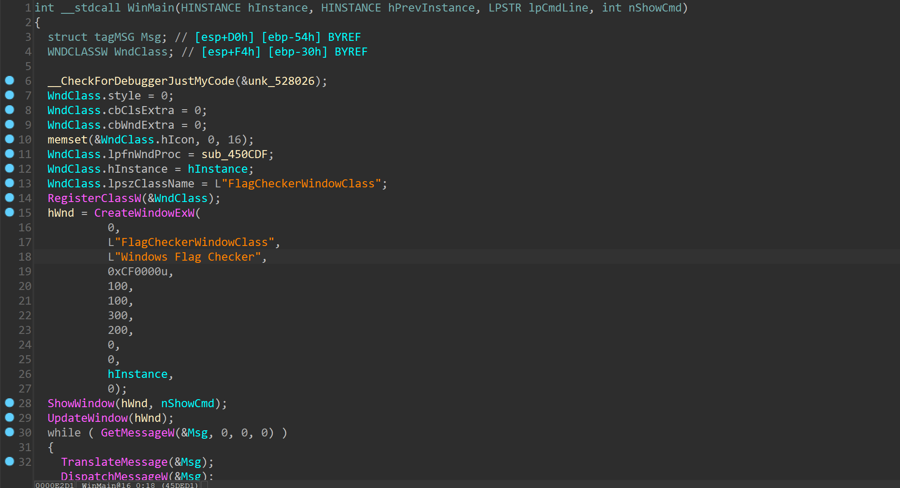

IDA打开之后可以看到是一个很标准的Windows程序

`WndClass.hpfnWnProc = sub_450CDF`这一句是注册回调函数，而`sub_450CDF`则是我们要找处理消息的回调函数

```
LRESULT __stdcall sub_45BF90(HWND hWndParent, UINT Msg, WPARAM wParam, LPARAM lParam)
{
  HWND DlgItem; // eax
  char v6[36]; // [esp+258h] [ebp-4E0h] BYREF
  char v7[36]; // [esp+27Ch] [ebp-4BCh] BYREF
  char v8[36]; // [esp+2A0h] [ebp-498h] BYREF
  WCHAR String[516]; // [esp+2C4h] [ebp-474h] BYREF
  HBRUSH hbr; // [esp+6CCh] [ebp-6Ch]
  HDC hDC; // [esp+6D8h] [ebp-60h]
  struct tagPAINTSTRUCT Paint; // [esp+6E4h] [ebp-54h] BYREF
  int v13; // [esp+734h] [ebp-4h]

  __CheckForDebuggerJustMyCode(&unk_528026);
  if ( Msg > 0xF )
  {
    if ( Msg == 16 )
    {
      DestroyWindow(hWndParent);
    }
    else
    {
      if ( Msg != 273 )
        return DefWindowProcW(hWndParent, Msg, wParam, lParam);
      if ( (unsigned __int16)wParam == 1 )
      {
        DlgItem = GetDlgItem(hWndParent, 2);
        GetWindowTextW(DlgItem, String, 1024);
        sub_450C94(String);
        v13 = 0;
        sub_450A0A(v7, v8);
        LOBYTE(v13) = 1;
        sub_450C94(a91);
        if ( (unsigned __int8)sub_4531AB(v7, v6) )
          MessageBoxW(hWndParent, L"Congratulations! flag is correct！", L"hint", 0);
        else
          MessageBoxW(hWndParent, L"Sorry, flag error.", L"hint", 0);
        sub_4529B8(v6);
        LOBYTE(v13) = 0;
        sub_4529B8(v7);
        v13 = -1;
        sub_4529B8(v8);
      }
    }
  }
  else
  {
    switch ( Msg )
    {
      case 0xFu:
        hDC = BeginPaint(hWndParent, &Paint);
        hbr = CreateSolidBrush(0xFFFFFFu);
        FillRect(hDC, &Paint.rcPaint, hbr);
        DeleteObject(hbr);
        EndPaint(hWndParent, &Paint);
        break;
      case 1u:
        CreateWindowExW(0, L"STATIC", L"Please input flag:", 0x50000000u, 10, 10, 120, 20, hWndParent, 0, 0, 0);
        CreateWindowExW(0, L"EDIT", &word_4FE15C, 0x50800000u, 10, 40, 250, 30, hWndParent, (HMENU)2, 0, 0);
        CreateWindowExW(0, L"BUTTON", L"submit", 0x50000000u, 10, 80, 80, 30, hWndParent, (HMENU)1, 0, 0);
        break;
      case 2u:
        PostQuitMessage(0);
        break;
      default:
        return DefWindowProcW(hWndParent, Msg, wParam, lParam);
    }
  }
  return 0;
}
```

点进来可以看到，sub_4531AB()应该是check()函数

因为windows程序有一些数据的数据类型ida会识别成函数，所以这里的变量看的不是很清楚

建议动态调试一下（

程序会一直运行WinMain里的循环等待用户的消息，所以我们断点要下在回调函数里

```
DlgItem = GetDlgItem(hWndParent, 2);
GetWindowTextW(DlgItem, String, 1024);
```

这两句是获取文本框里的数据赋值给String，所以我们断点可以下在这里

输入flag{test}，点击submit,函数停到这里，接下来就是一步一步调

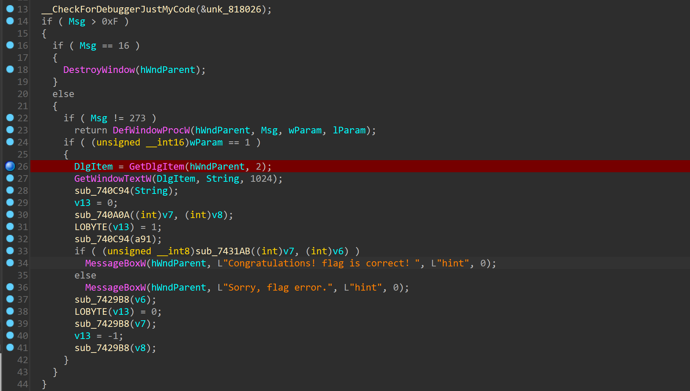


调的过程中会发现，`sub_740C94`这个函数里有很多函数，且意义不明，对参数（String,a91）没啥影响，怀疑可能是Windows程序的一些特有的数据类型，IDA给弄成函数了

而`sub_470A0A`会对我们的输入进行一个操作

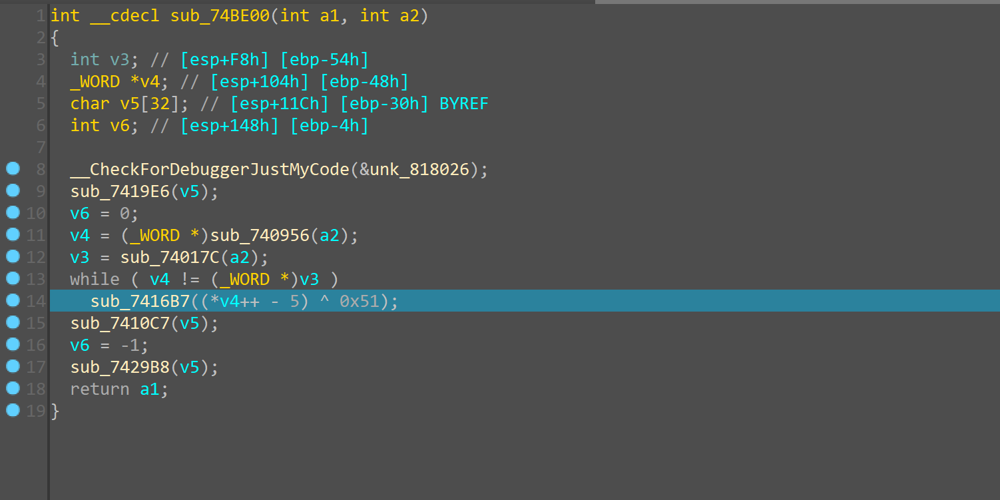

调试可知，v3是输入尾值的下一位，v4是第一个值，`sub_7416B7`没有对参数进行任何操作，所以仅仅是进行了(input-5)^0x51

接着调，check函数里看看干了什么

一直往下点，只看返回值

可以找到`return a2 == a4 && !sub_740654(a1, a3, a2);`这一句。输入不同的数据发现a4的值在变化，而a2的值一直等于0x1e，观察可知a4是我们输入的长度，而a2则应该是flag的长度。

再调后面的，会到这里

```
int __cdecl sub_74E010(unsigned __int16 *a1, unsigned __int16 *a2, int a3)
{
  __CheckForDebuggerJustMyCode(&unk_81801A);
  while ( 1 )
  {
    if ( !a3 )
      return 0;
    if ( *a1 != *a2 )
      break;
    ++a1;
    ++a2;
    --a3;
  }
  if ( *a1 >= (int)*a2 )
    return 1;
  else
    return -1;
}
```

可以很清晰的看到`*a1 != *a2`，鼠标点进去，会发现我们加密后的输入会跟一个数组进行比较，比较的长度是a3的值，而这里的a3就是

`return a2 == a4 && !sub_740654(a1, a3, a2);`这里的a2，也就是就是flag的长度

最后，提取出比较的那个数组，再异或回去即可。

```
enc=[0x0039, 0x003B, 0x0031, 0x000F, 0x003E, 0x0030, 0x0027, 0x0013, 0x0001, 0x007D, 0x0070, 0x0070, 0x0003, 0x007D, 0x0038, 0x000E, 0x007A, 0x0023, 0x007C, 0x000B, 0x001A, 0x003C, 0x007D, 0x0039, 0x007F, 0x003C, 0x004D, 0x004D, 0x004D, 0x0029]
for i in range(len(enc)):
  print(chr((enc[i]^0x51)+5),end="")
#moectf{GU1&&W1nd0w2_Pr1m3r!!!}
```

其实那个数组就是`sub_740C94()(a91)`里的参数a91，有些选手可能猜出来的哈哈（有没有可能吧这个a91想个办法藏起来呢？

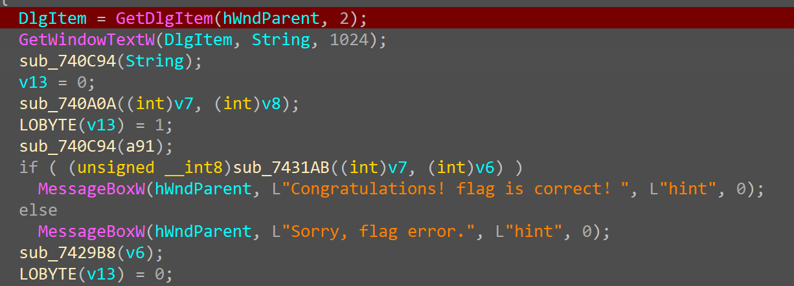

## XOR
如题目所言，只是个简单的异或
拖入ida反编译
```c
__int64 __fastcall main()
{
  int i; // [rsp+2Ch] [rbp-34h]
  unsigned __int8 input[29]; // [rsp+30h] [rbp-30h] BYREF
  int v3; // [rsp+5Ch] [rbp-4h]

  _main();
  v3 = 0;
  memset(input, 0, sizeof(input));
  printf("Please input the flag:\n");
  gets(input);
  for ( i = 0; i < 28; ++i )
  {
    if ( enc[i] != (input[i] ^ 0x39) )
    {
      puts("Seems not right");
      exit(0);
    }
  }
  puts("GOOD!");
  return 0i64;
}
```
将input异或0x39再和enc比较
双击enc提取数据


光标选上按shift+E

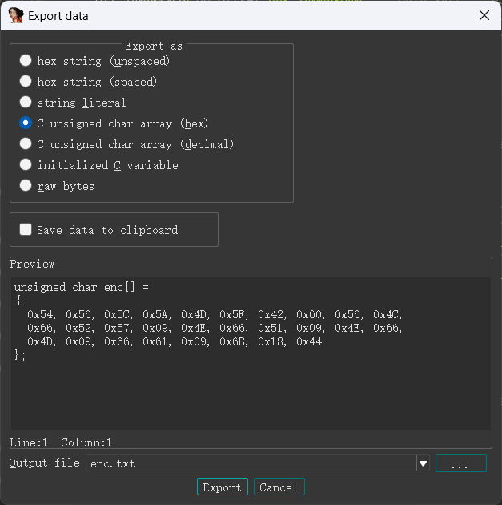

提取后写脚本或使用CyberChef异或即可

## SMC
考察SMC相关知识
SMC，即自修改代码。

本题中部分函数静态反编译的时候是加密的，运行的时候进行了自修改解

代码段原本是不可写入的，那么程序要实现这一功能，就需要做一些特别的操作，也就是改变内存的权限
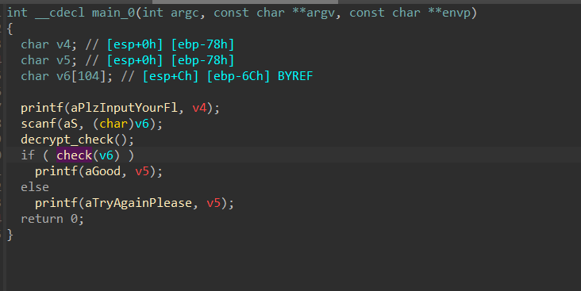
对代码重新标注后如上
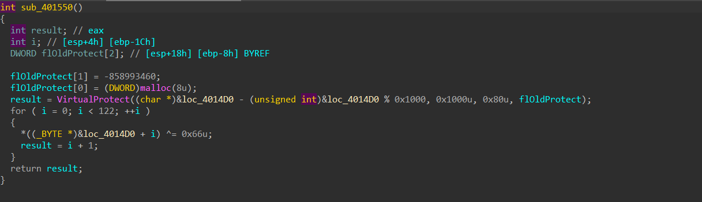
而此时decrypt的方法就很明显了，也就是对check函数进行异或0x66,在这之前使用VirtualProtect函数将其权限添加了可写

所以比较好的方法就是直接使用ida调试，等待程序自行解密（方法自行上网学习）

解密完了之后选中

这段数据是代码，但是ida不认识。按c键告诉ida这是代码，要反编译还需要创建函数，在代码开头按p，再f5
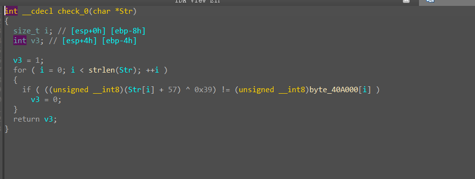
为+57再异或0x39，自行解密即可

## ANDROID

简单安卓逆向

拖入jadx

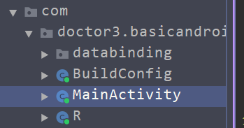

定位到MainActivity，或者搜索字符串定位(按上方放大镜，然后搜索运行时产生的字符串)


逻辑也是异或，但是此时key循环利用，同样可以使用python或是CyberChef进行解密

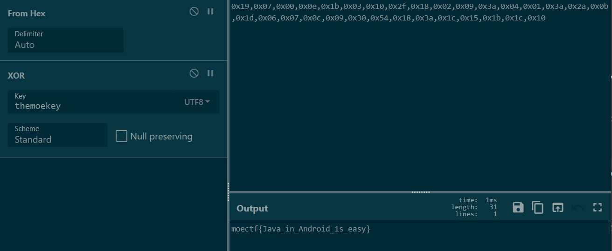

## ezandroid
被打烂了（

~~本来是做了100多个fake maze然后Onload里面异或了一位，后来降低新手做题难度，然后就被嗯试出来了（~~

~~真的不累吗~~

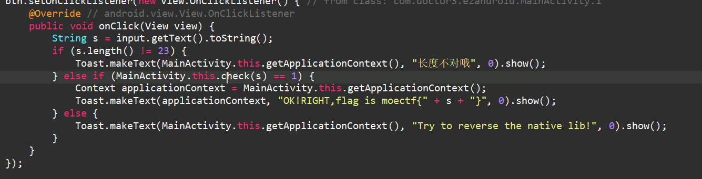
校检输入长度之后调用check方法
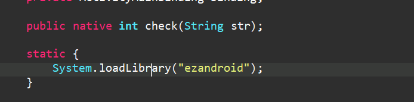
发现check是native方法，在libezandroid.so里面

对于native方法逆向，请大家先上网查找JNI相关知识，获取jni.h

这里不再赘述

搜索Java，发现没有静态注册check方法，此时可以去看看JNI_Onload，这个函数会在库被载入的时候调用
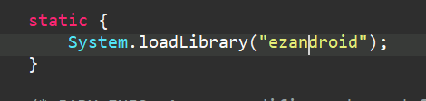
也就是此时，会调用此方法


这里获取了类名，看起来像是在注册方法
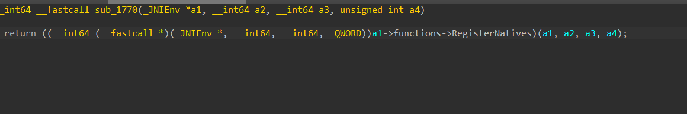
加载jni.h修改a1为jnienv（不懂请先补基础知识！）
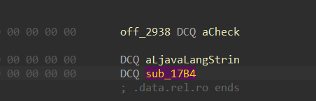
发现注册了sub_17b4为check
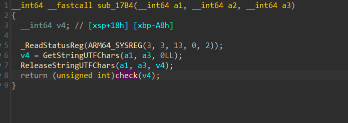
这两个函数同样修改a1为env即可得到，将java string转化为了c string

这里是最终的校检，就是走迷宫

但是请注意，JNI_Onload里面已经对迷宫做了修改，所以使用Onload中的迷宫即可

## Rust
**请先按照提示安装插件，恢复部分符号**
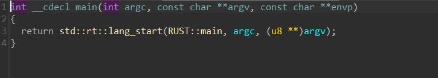
这一部分在启动rust的main函数，点进参数1
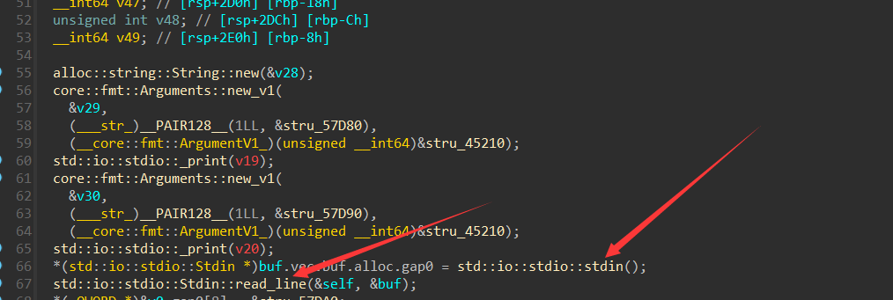
通过调试和阅读，发现此处读入了用户输入
v0由unwrap而来，是我们的输入

此处调用len，和30比较，不符合推出，明显是在校检flag的长度
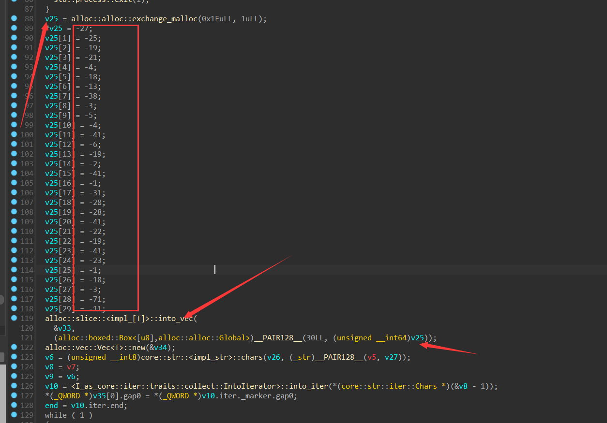
方框的一串数据v25很像是密文，下面调用into_vec将其push进一个Vec（一种RS数据结构）中
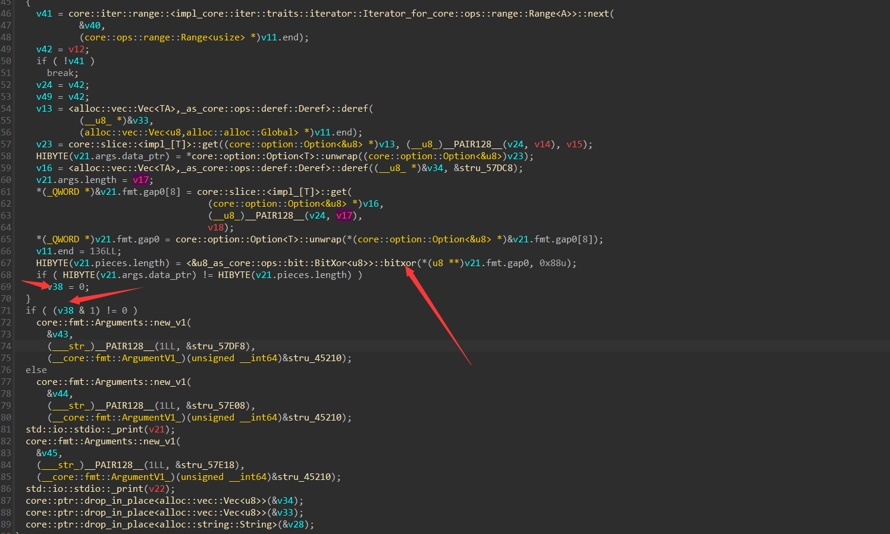
这一部分是关键，bitXor是异或0x88，前面是套娃取数据的部分（逃
v38作为是否正确判断，分别打印不同的输出

到这里就很清楚了，异或即可
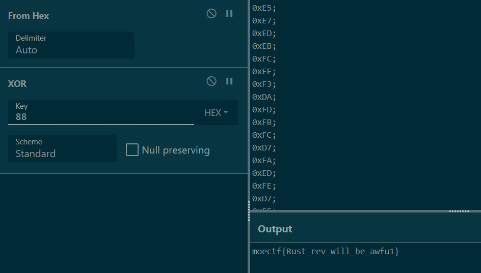

## unwind

题目很简单，源码和exp均已给出。输入函数中存在反调试，自己patch掉即可。然后是TEA加密。对于后一半flag，触发异常后，由于栈展开，调用了2次TEA加密。
关于这部分的详细内容可以查看[深入解析结构化异常处理(SEH)](https://blog.csdn.net/aa13058219642/article/details/80253609)的第二节。关于本题也有选手写了详细的解题报告可以查看：[Windows x86 SEH 机制暨MoeCTF2023 Unwind 解题报告](https://blog.littflower.top/posts/moectf2023-unwind-and-a-little-windows-seh/)，~~我就不再抄一遍了（逃~~
