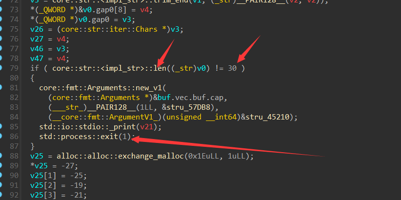
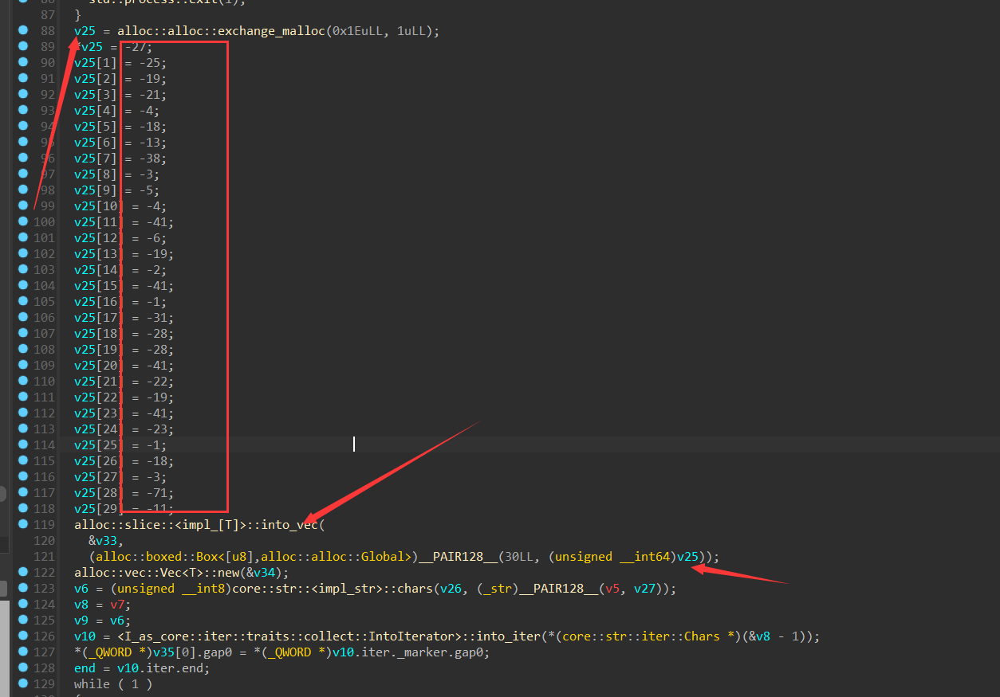
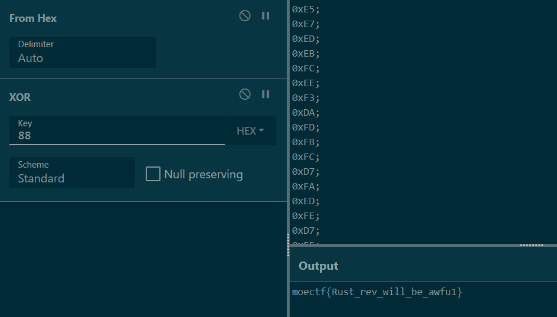

## Rust
**请先按照提示安装插件，恢复部分符号**

这一部分在启动rust的main函数，点进参数1

通过调试和阅读，发现此处读入了用户输入
v0由unwrap而来，是我们的输入

此处调用len，和30比较，不符合推出，明显是在校检flag的长度

方框的一串数据v25很像是密文，下面调用into_vec将其push进一个Vec（一种RS数据结构）中

这一部分是关键，bitXor是异或0x88，前面是套娃取数据的部分（逃
v38作为是否正确判断，分别打印不同的输出

到这里就很清楚了，异或即可

