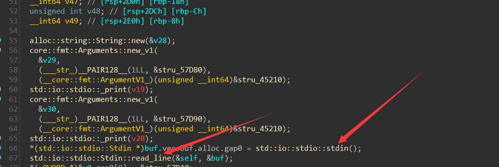

# By doctor3
## XOR
如题目所言，只是个简单的异或
拖入ida反编译
```c
__int64 __fastcall main()
{
  int i; // [rsp+2Ch] [rbp-34h]
  unsigned __int8 input[29]; // [rsp+30h] [rbp-30h] BYREF
  int v3; // [rsp+5Ch] [rbp-4h]

  _main();
  v3 = 0;
  memset(input, 0, sizeof(input));
  printf("Please input the flag:\n");
  gets(input);
  for ( i = 0; i < 28; ++i )
  {
    if ( enc[i] != (input[i] ^ 0x39) )
    {
      puts("Seems not right");
      exit(0);
    }
  }
  puts("GOOD!");
  return 0i64;
}
```
将input异或0x39再和enc比较
双击enc提取数据

光标选上按shift+E

提取后写脚本或使用CyberChef异或即可

## ANDROID
简单安卓逆向
拖入jadx

定位到MainActivity，或者搜索字符串定位(按上方放大镜，然后搜索运行时产生的字符串)

逻辑也是异或，但是此时key循环利用，同样可以使用python或是CyberChef进行解密


## SMC
考察SMC相关知识
SMC，即自修改代码。

本题中部分函数静态反编译的时候是加密的，运行的时候进行了自修改解

代码段原本是不可写入的，那么程序要实现这一功能，就需要做一些特别的操作，也就是改变内存的权限

对代码重新标注后如上

而此时decrypt的方法就很明显了，也就是对check函数进行异或0x66,在这之前使用VirtualProtect函数将其权限添加了可写

所以比较好的方法就是直接使用ida调试，等待程序自行解密（方法自行上网学习）

解密完了之后选中

这段数据是代码，但是ida不认识。按c键告诉ida这是代码，要反编译还需要创建函数，在代码开头按p，再f5

为+57再异或0x39，自行解密即可

## Rust
**请先按照提示安装插件，恢复部分符号**

这一部分在启动rust的main函数，点进参数1

通过调试和阅读，发现此处读入了用户输入
v0由unwrap而来，是我们的输入

此处调用len，和30比较，不符合推出，明显是在校检flag的长度

方框的一串数据v25很像是密文，下面调用into_vec将其push进一个Vec（一种RS数据结构）中

这一部分是关键，bitXor是异或0x88，前面是套娃取数据的部分（逃
v38作为是否正确判断，分别打印不同的输出

到这里就很清楚了，异或即可


## ezandroid
被打烂了（

~~本来是做了100多个fake maze然后Onload里面异或了一位，后来降低新手做题难度，然后就被嗯试出来了（~~

~~真的不累吗~~


校检输入长度之后调用check方法

发现check是native方法，在libezandroid.so里面

对于native方法逆向，请大家先上网查找JNI相关知识，获取jni.h

这里不再赘述


搜索Java，发现没有静态注册check方法，此时可以去看看JNI_Onload，这个函数会在库被载入的时候调用

也就是此时，会调用此方法


这里获取了类名，看起来像是在注册方法

加载jni.h修改a1为jnienv（不懂请先补基础知识！）

发现注册了sub_17b4为check

这两个函数同样修改a1为env即可得到，将java string转化为了c string

这里是最终的校检，就是走迷宫

但是请注意，JNI_Onload里面已经对迷宫做了修改，所以使用Onload中的迷宫即可
