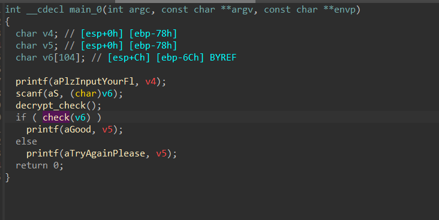
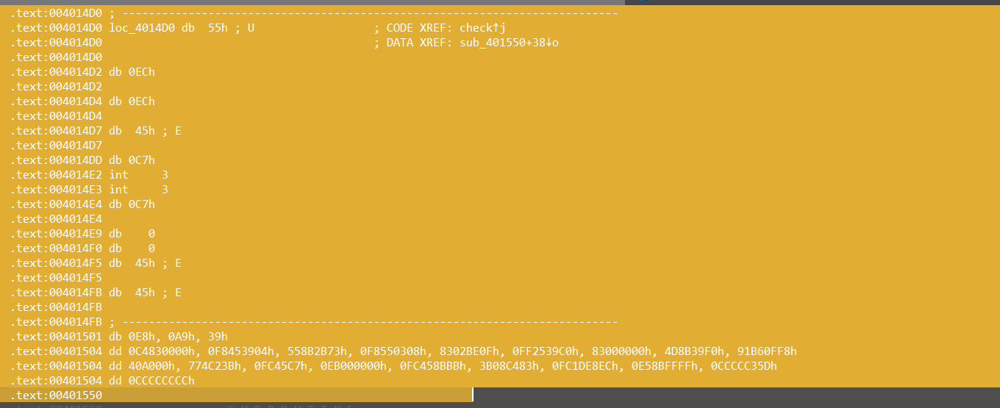

## SMC
考察SMC相关知识
SMC，即自修改代码。

本题中部分函数静态反编译的时候是加密的，运行的时候进行了自修改解

代码段原本是不可写入的，那么程序要实现这一功能，就需要做一些特别的操作，也就是改变内存的权限

对代码重新标注后如上

而此时decrypt的方法就很明显了，也就是对check函数进行异或0x66,在这之前使用VirtualProtect函数将其权限添加了可写

所以比较好的方法就是直接使用ida调试，等待程序自行解密（方法自行上网学习）

解密完了之后选中

这段数据是代码，但是ida不认识。按c键告诉ida这是代码，要反编译还需要创建函数，在代码开头按p，再f5

为+57再异或0x39，自行解密即可
