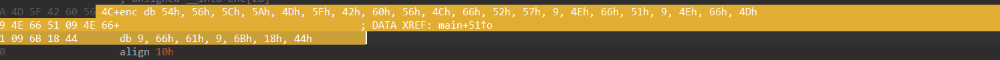
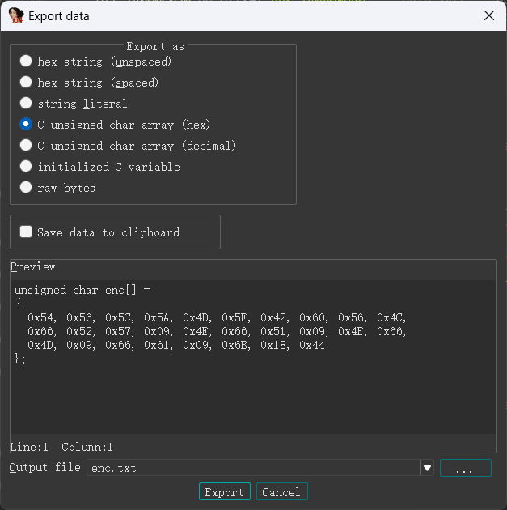

## XOR
如题目所言，只是个简单的异或
拖入ida反编译
```c
__int64 __fastcall main()
{
  int i; // [rsp+2Ch] [rbp-34h]
  unsigned __int8 input[29]; // [rsp+30h] [rbp-30h] BYREF
  int v3; // [rsp+5Ch] [rbp-4h]

  _main();
  v3 = 0;
  memset(input, 0, sizeof(input));
  printf("Please input the flag:\n");
  gets(input);
  for ( i = 0; i < 28; ++i )
  {
    if ( enc[i] != (input[i] ^ 0x39) )
    {
      puts("Seems not right");
      exit(0);
    }
  }
  puts("GOOD!");
  return 0i64;
}
```
将input异或0x39再和enc比较
双击enc提取数据


光标选上按shift+E



提取后写脚本或使用CyberChef异或即可
