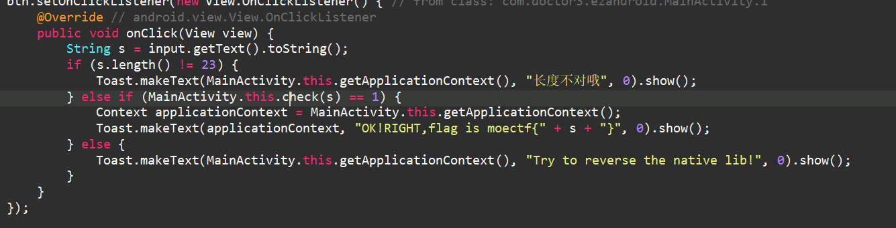
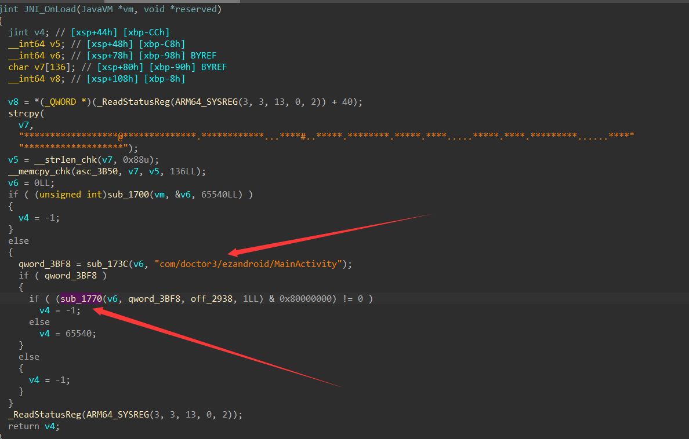
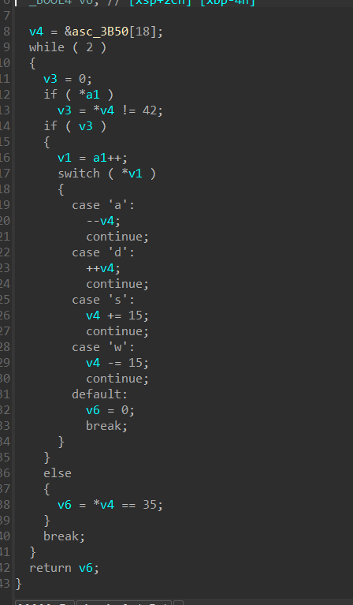

## ezandroid
被打烂了（

~~本来是做了100多个fake maze然后Onload里面异或了一位，后来降低新手做题难度，然后就被嗯试出来了（~~

~~真的不累吗~~

校检输入长度之后调用check方法

发现check是native方法，在libezandroid.so里面

对于native方法逆向，请大家先上网查找JNI相关知识，获取jni.h

这里不再赘述

搜索Java，发现没有静态注册check方法，此时可以去看看JNI_Onload，这个函数会在库被载入的时候调用

也就是此时，会调用此方法

这里获取了类名，看起来像是在注册方法

加载jni.h修改a1为jnienv（不懂请先补基础知识！）

发现注册了sub_17b4为check

这两个函数同样修改a1为env即可得到，将java string转化为了c string

这里是最终的校检，就是走迷宫

但是请注意，JNI_Onload里面已经对迷宫做了修改，所以使用Onload中的迷宫即可
