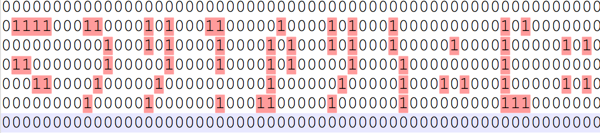
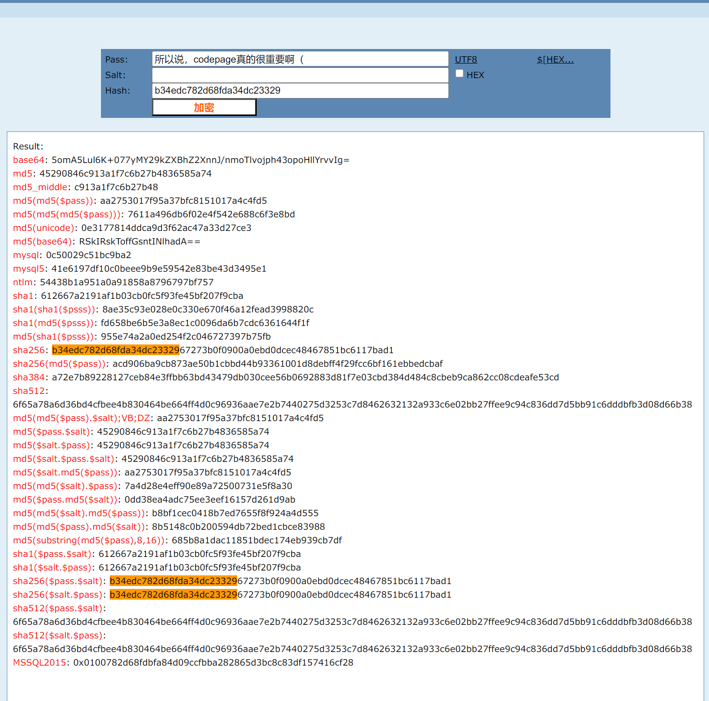

# Classical-Crypto
### Author: 0xcafebabe

## CHALLENGE: base乐队

```
HFUEULC5HEZG42DGHFGDWSCTHRCUIUSVHFGDWS2EGZMCCRDKG5XG2LDEHFUTYYZGHJSUMKKDGVZDELBRHBIW4UCQGZLGOP2SHEYV44ZOHEZFYXCZHEYUIV2VGEXVK4KRHBWFWY2OHVMWSYCKG5XFCZTBHEZC6I2WHJST2ZK4HEXTSMDSHA3CKZRZGRNHI4LL
```

https://cyberchef.org/#recipe=From_Base32('A-Z2-7%3D',false)From_Base85('!-u',true,'z')From_Base32('A-Z2-7%3D',false)&input=SEZVRVVMQzVIRVpHNDJER0hGR0RXU0NUSFJDVUlVU1ZIRkdEV1MyRUdaTUNDUkRLRzVYRzJMREVIRlVUWVlaR0hKU1VNS0tER1ZaREVMQlJIQklXNFVDUUdaTEdPUDJTSEVZVjQ0Wk9IRVpGWVhDWkhFWVVJVjJWR0VYVks0S1JIQldGV1kyT0hWTVdTWUNLRzVYRkNaVEJIRVpDNkkyV0hKU1QyWks0SEVYVFNNRFNIQTNDS1pSWkdSTkhJNExM

自动解码到了：bYeNQXYZXbXZQfW31FGzzD0m0FHQ9RR85FFQYMB9M=lmo2ku11z0uiz=

可能是base64，但是根据base64编码准则，=是padding，只能在最后面，所以一定是一个编码法则更改了相对位置。

所以想到了栅栏密码，但是我的Cyber解不开，所以用了其他的在线解密工具解出来了

https://www.qqxiuzi.cn/bianma/zhalanmima.php

参数：每组字数：4
得到
```
bW9lY3Rme1RoNF82QG5kXzFuYzF1ZDQ1X0YzbmM0X0BuZF9iQHMzfQ==
```
那么答案显然了，由于这里纸太小写不下就不写了。

---

## CHALLENGE: building_near_lake
```
本题给了一个照片，找到地方后显然旁边有个湖，完美符合标题，故容易解出。
```

---

## CHALLENGE: 狗子xxx（我的世界附魔字符）

```
False False False False False False False False False False False False False False False False False False False False False False False False False False False False False False False False False False False False False False False False False False False False False False False False False False False False False False False False False False False 
False True True True True False False False True True False False False False True False True False False False True True False False False False False True False False False False True False True False False False True False False False False False False False False False False True False True False False False False False False False 
False False False False False False False False False False True False False False True False True False False False False True False False False False True False True False False False True False True False False False True False False False False False True False False False False True False False False False False True False True False 
False True True False False False False False False False True False False False False False True False False False False True False False False False True False True False False False False False True False False False False True False False False False False False False False False True False False False False False False False False False 
False False False True True False False False False True False False False False False True False False False False False False False False False False True False False False False False False True False False False False False True False False False True False True False False False True False False False False False True False True False 
False False False False False False False False True False False False False False True False False False False False False True False False False True True False False False False False True False False False False False False True False False False False False False False False False True True True False False False False False False False 
False False False False False False False False False False False False False False False False False False False False False False False False False False False False False False False False False False False False False False False False False False False False False False False False False False False False False False False False False False False 
```
改成0和1发现是字符，对照我的世界附魔字符对应表易得答案


---

## CHALLENGE: 复读机

```py
__import__("os").system("sh")
```

```sh
ls
cat flag.txt
```

---


## CHALLENGE: 烫烫烫

```
+j9k-+Zi8-+T2A-+doQ-flag+/xo-+AAo-+AAo-a9736d8ad21107398b73324694cbcd11f66e3befe67016def21dcaa9ab143bc4405be596245361f98db6a0047b4be78ede40864eb988d8a4999cdcb31592fd42c7b73df3b492403c9a379a9ff5e81262+AAo-+AAo-+T0Y-+Zi8-flag+dSg-AES+UqA-+W8Y-+ToY-+/ww-key+Zi8-+Tgs-+l2I-+j9k-+iEw-+W1c-+doQ-sha256+/wg-hash+UDw-+doQ-+XwA-+WTQ-+Zi8-b34edc782d68fda34dc23329+/wk-+AAo-+AAo-+YkA-+TuU-+i/Q-+/ww-codepage+dx8-+doQ-+X4g-+kc0-+iYE-+VUo-+/wg-+AAo-
```


https://cyberchef.org/#recipe=Decode_text('UTF-7%20(65000)')&input=K2o5ay0rWmk4LStUMkEtK2RvUS1mbGFnKy94by0rQUFvLStBQW8tYTk3MzZkOGFkMjExMDczOThiNzMzMjQ2OTRjYmNkMTFmNjZlM2JlZmU2NzAxNmRlZjIxZGNhYTlhYjE0M2JjNDQwNWJlNTk2MjQ1MzYxZjk4ZGI2YTAwNDdiNGJlNzhlZGU0MDg2NGViOTg4ZDhhNDk5OWNkY2IzMTU5MmZkNDJjN2I3M2RmM2I0OTI0MDNjOWEzNzlhOWZmNWU4MTI2MitBQW8tK0FBby0rVDBZLStaaTgtZmxhZytkU2ctQUVTK1VxQS0rVzhZLStUb1ktKy93dy1rZXkrWmk4LStUZ3MtK2wySS0rajlrLStpRXctK1cxYy0rZG9RLXNoYTI1Nisvd2ctaGFzaCtVRHctK2RvUS0rWHdBLStXVFEtK1ppOC1iMzRlZGM3ODJkNjhmZGEzNGRjMjMzMjkrL3drLStBQW8tK0FBby0rWWtBLStUdVUtK2kvUS0rL3d3LWNvZGVwYWdlK2R4OC0rZG9RLStYNGctK2tjMC0raVlFLStWVW8tKy93Zy0rQUFvLQ&oenc=65001


### 小提示：记得改CyberChef输出为UTF-8，要不然显示不了中文


然后在cmd5.com对pass进行测试，Hash输入的是比对的值，可以高亮



https://cyberchef.org/#recipe=AES_Decrypt(%7B'option':'Hex','string':'b34edc782d68fda34dc2332967273b0f0900a0ebd0dcec48467851bc6117bad1'%7D,%7B'option':'Hex','string':''%7D,'ECB','Hex','Raw',%7B'option':'Hex','string':''%7D,%7B'option':'Hex','string':''%7D)&input=YTk3MzZkOGFkMjExMDczOThiNzMzMjQ2OTRjYmNkMTFmNjZlM2JlZmU2NzAxNmRlZjIxZGNhYTlhYjE0M2JjNDQwNWJlNTk2MjQ1MzYxZjk4ZGI2YTAwNDdiNGJlNzhlZGU0MDg2NGViOTg4ZDhhNDk5OWNkY2IzMTU5MmZkNDJjN2I3M2RmM2I0OTI0MDNjOWEzNzlhOWZmNWU4MTI2Mg&oenc=65001

得到flag

```
moectf{codep@ge_pl@ys_@n_iMport@nt_role_in_intern@tion@liz@tion_g92WPIB}
```

---

## CHALLENGE: 尊嘟假嘟

### 注：最难猜的一题

在 线 解 密：

https://www.zdjd.asia/

翻译后
```
cipher: rY5Ah8BtsYYatLEPu8YCPU22Gr5PQt8YGDKkvb4bk3D4JJeEe5kgCpoEqgRzsM7m9d8jEtE3LUoKpULQnMcuAunU1gtpzC5kSUxFctFTNCMZVHLHZNCo5akzKMRY5bbyBP7RNUeGDEYoUc
key: the tailing 8 bytes of hash of "zundujiadu?" which begin with b6091904cdfb
iv: the end 8 bytes of hash of "dududu?" which begin with 272bf1da2207

hint1: how do Bitcoin addresses encode?
hint2: the name of cryptosystem is "bl****sh"
```

```
注意到，比特币address的encode是base58，bl xxx sh观察到是Blowfish
然后去cmd5.comd去搜索hash，发现
key = 57e55c126f1557b3
iv =  67e9fca0871f9834
```

得到
```
https://cyberchef.org/#recipe=From_Base58('123456789ABCDEFGHJKLMNPQRSTUVWXYZabcdefghijkmnopqrstuvwxyz',true)Blowfish_Decrypt(%7B'option':'Hex','string':'57e55c126f1557b3'%7D,%7B'option':'Hex','string':'67e9fca0871f9834'%7D,'CBC','Raw','Raw')From_Base64('A-Za-z0-9%2B/%3D',true,false)&input=clk1QWg4QnRzWVlhdExFUHU4WUNQVTIyR3I1UFF0OFlHREtrdmI0YmszRDRKSmVFZTVrZ0Nwb0VxZ1J6c003bTlkOGpFdEUzTFVvS3BVTFFuTWN1QXVuVTFndHB6QzVrU1V4RmN0RlROQ01aVkhMSFpOQ281YWt6S01SWTViYnlCUDdSTlVlR0RFWW9VYw

moectf{wow_you_aRe_the_masteR_of_Zundujiadu_92WPIBung92WPIBung9?WPIBung}
```
---

## CHALLENGE: 奇怪的压缩包
### 就..就找呗，一眼是PPT，打开后慢慢找，一个在图片后面，一个在旁边的注解，还有个底色改了，凑齐几大神器就能合成flag了

---

## CHALLENGE: 打不开的图片(1)
### 文件头有问题，改后打开属性可以拿到Flag

---

## CHALLENGE: 打不开的图片(2)
### jpg但是png（实际是png），改文件头后打开得到flag

---

## CHALLENGE: 机位查询
### 做了一早上一下午，提交了好多组flag都不对，比赛结束后才知道第三章图片有exif经纬度信息。

---

## CHALLENGE: 照片冲洗
### 可以分离出两个图片，但是最后没做出来

## CHALLENGE: weird_package
### 没看

---

## CHALLENGE: 题目忘了，和压缩包有关，里面嵌套压缩包
### 本题里面压缩包套压缩包，而且zip rar tar三种随机出现，故使用python进行循环解压就行

```py
import os
import zipfile
import tarfile
import py7zr

lastname = 'shell9997.tar.gz'

while True:
    if lastname.find('zip') != -1:
        zip = zipfile.ZipFile(lastname, 'r')
        lastname = zip.namelist()[0]
        zip.extractall('./')
    elif lastname.find('tar') != -1:
        tar = tarfile.open(lastname)
        lastname = tar.getnames()[0]
        tar.extractall('./')
    elif lastname.find('7z') != -1:
        archive = py7zr.SevenZipFile(lastname, mode='r')
        lastname = archive.getnames()[0]
        archive.extractall(path='./')
        archive.close()
    
```


### 注：写WP时题目未完全上传到github，所以还没写完！