# moeCTF2023-wp re部分

作者：Chick

## EQUATION

用IDA打开可以看到main函数里有一堆方程，根据提示可以使用python里的z3库。同时值得注意的是IDA的识别有问题，char数组的长度应该是31。

```python
from z3 import *

def solve():
    solver = Solver()
    input = [Int(i) for i in range(31)]
    condi = [334 * input[28]
     + 100 * input[27]
     + 369 * input[26]
     + 124 * input[25]
     + 278 * input[24]
     + 158 * input[23]
     + 162 * input[22]
     + 145 * input[19]
     + 27 * input[17]
     + 91 * input[15]
     + 195 * input[14]
     + 342 * input[13]
     + 391 * input[10]
     + 204 * input[9]
     + 302 * input[8]
     + 153 * input[7]
     + 292 * input[6]
     + 382 * input[5]
     + 221 * input[4]
     + 316 * input[3]
     + 118 * input[2]
     + 295 * input[1]
     + 247 * input[0]
     + 236 * input[11]
     + 27 * input[12]
     + 361 * input[16]
     + 81 * input[18]
     + 105 * input[20]
     + 65 * input[21]
     + 67 * input[29]
     + 41 * input[30] == 596119,
    371 * input[29]
     + 338 * input[28]
     + 269 * input[27]
     + 312 * input[26]
     + 67 * input[25]
     + 299 * input[24]
     + 235 * input[23]
     + 294 * input[22]
     + 303 * input[21]
       
 '''
 这里太长了就只放了部分
 z3库不识别左移，所以要手动把左移改成乘
 '''
             
     + 261 * input[1]
     + 10 * input[2]
     + 345 * input[13]
     + 3 * input[14]
     + 361 * input[30] == 659149,
             361 * input[29]
     + 359 * input[28]
     + 93 * input[27]
     + 315 * input[26]
     + 69 * input[25]
     + 137 * input[24]
     + 69 * input[23]
     + 58 * input[22]
     + 300 * input[21]
     + 371 * input[20]
     + 264 * input[19]
     + 317 * input[18]
     + 215 * input[17]
     + 155 * input[16]
     + 215 * input[15]
     + 330 * input[14]
     + 239 * input[13]
     + 212 * input[12]
     + 88 * input[11]
     + 82 * input[10]
     + 354 * input[9]
     + 85 * input[8]
     + 310 * input[7]
     + 84 * input[6]
     + 374 * input[5]
     + 380 * input[4]
     + 215 * input[3]
     + 351 * input[2]
     + 141 * input[1]
     + 115 * input[0]
     + 108 * input[30] == 629123]
    solver.add(condi)
    if solver.check() == sat:
        model = solver.model()
        res = [model[input[i]] for i in range(31)]
        flag = ""
        for i in res:
            flag += chr(int(i.__str__()))
        print(flag)
    else:
        print("NO!")


if __name__ == '__main__':
    solve()
```


## junk_code

进到IDA里，main函数里输入了一段36个字符的flag，然后将flag分成两段进行检测。每一段进去后都是红色。进到第一个检测函数里看到在0x460610里跳转到了0x462613处执行。而可以看到IDA反汇编是从0x460612开始的，但前面的\xe8是不需要的。

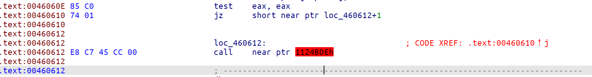

所以我们将0x460612处的字节设成\x90(nop)。可以看到就没有红色的了。

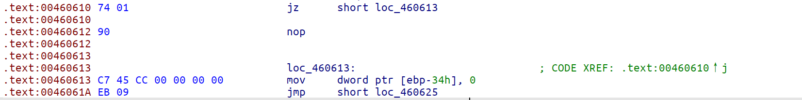

选中红色的部分，按P键创建一个新函数，再按F5反编译就可以了。

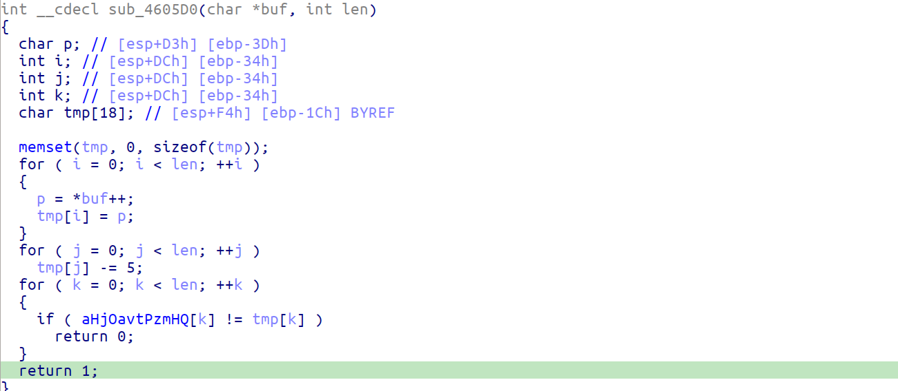

可以看到该函数只是将buf里面的值减去5,与一个密文进行比对而已。

同理可以将第二段把多余的E8删去，生成新函数可得

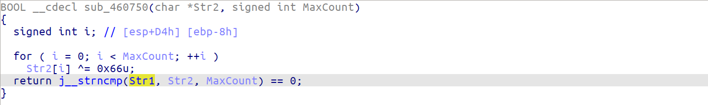

这将第二段异或0x66后与全局变量Str1进行比对。

解密脚本：

```python
key1 = b'hj`^oavt+pZm`h+q._'
key2 = [57, 18, 14, 85, 57, 12, 19, 8, 13, 57, 5, 86, 2, 85, 71, 71, 71, 27]

flag = ''

for i in key1:
    flag += chr(int(i) + 5)
for i in key2:
    flag += chr(i ^ 0x66)
print(flag)
```


## rust

用IDA打开，可以看到中间有一大片赋值的地方，可以推测这个地方是密文。

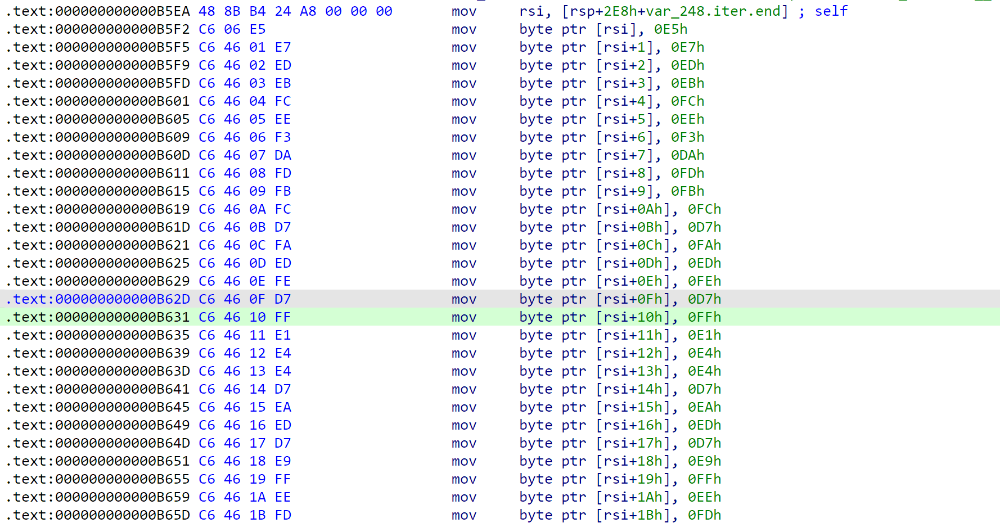

往下看，发现rust的反编译长得很怪，基本看不懂。

虽然看不懂，但是中间有一个函数`bitxor`，很明显是将密文按位异或0x88。将密文逐个异或0x88就可以得到flag。

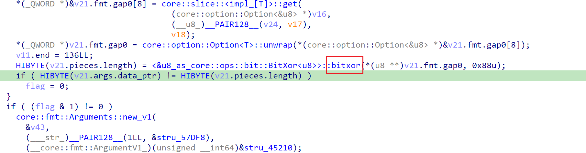

```python
key = [229, 231, 237, 235, 252, 238, 243, 218, 253, 251, 252, 215, 250, 237, 254, 215, 255, 225, 228, 228, 215, 234, 237, 215, 233, 255, 238, 253, 185, 245]

flag = ''

for i in key:
    flag += chr(i ^ 0x88)
print(flag)
```


## ezandroid

先用jadx打开

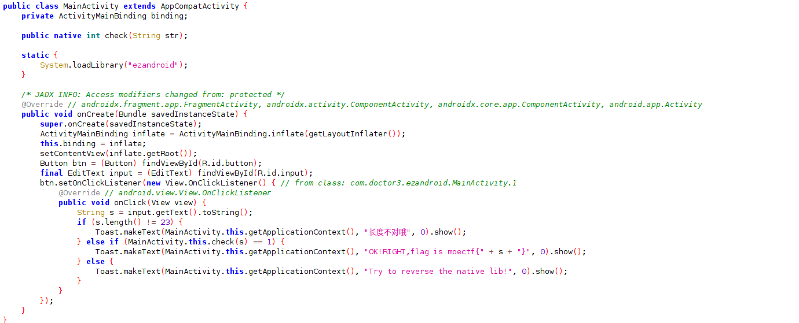

可以看到主程序使用了native里的库。把apk包解压，打开里面lib文件夹，选择一个版本后用IDA打开

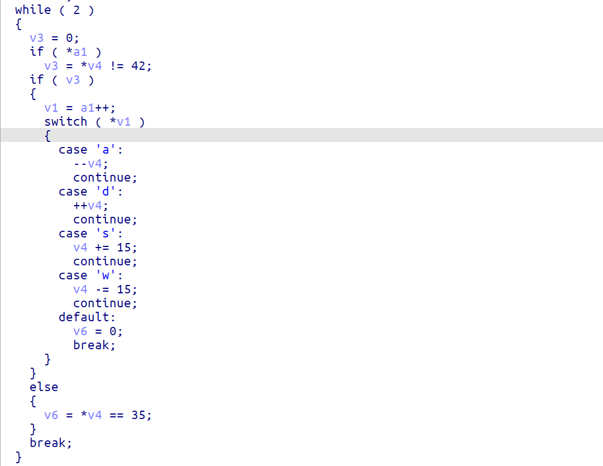

可以看到是一个迷宫问题。可以使用DFS写一个程序搜索路径，注意地图应该选用`JNI_OnLoad`函数里的，并且长度为23，在外面手动加上moectf{}即可。


## GUI

这道题我先用了x64dbg查看程序的入口，记下地址，然后打开IDA把跳转到对应地址~~，因为汇编代码太复杂，看不懂~~。

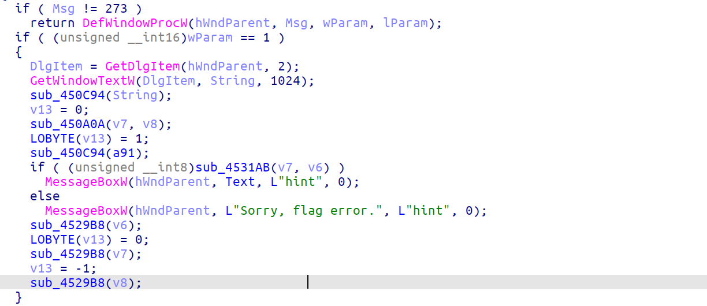

看到深色的a91，不用想都知道是密文。可以看到在输入后把string和a91都转递给了sub_450C94函数分别调用。但跟进后发现可能只是获取长度(?)。不过仔细一想确实密文不需要再进行加密，所以sub_450C94不可能是加密函数。if条件中的sub_4531AB函数跟进后发现使用了大量的this指针，感觉不像加密函数。那我们跟进一下中间的sub_450A0A，可以看到

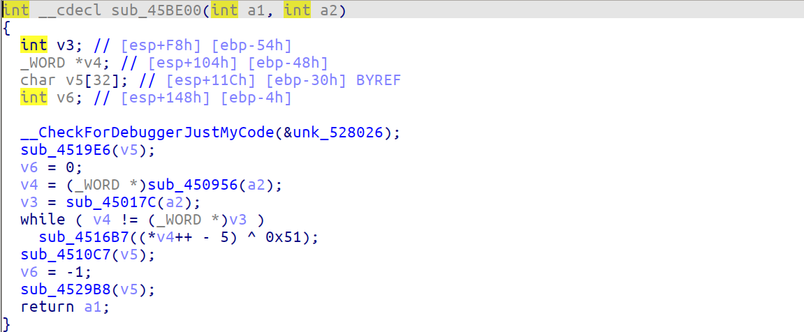

看到异或，基本八九不离十了，放到python解密一下就是flag。

```python
key = [57, 59, 49, 15, 62, 48, 39, 19, 1, 125, 112, 112, 3, 125, 56, 14, 122, 35, 124, 11, 26, 60, 125, 57, 127, 60, 77, 77, 77, 41]

flag = ''

for i in key:
    flag += chr((i ^ 0x51) + 5)
print(flag)
```


## unwind

打开IDA

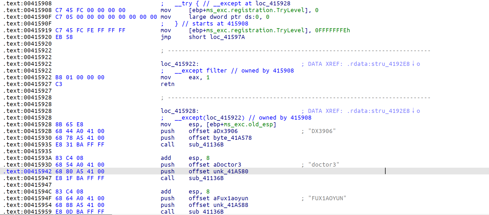

可以看到有一个try/except块，而try中一定会报错，所以直接运行到except中。except调用了sub_41136B函数，跟进看是tea加密。

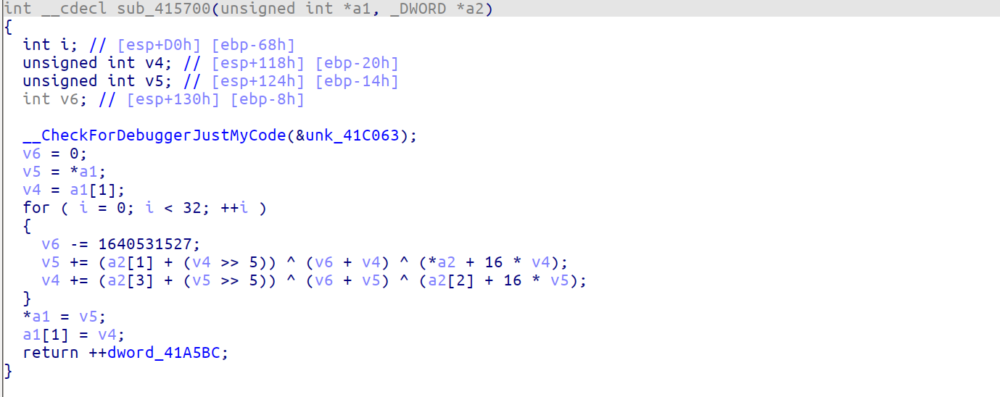

第一个try/except块是将flag的前半部分进行加密，后面还有一个try/except块将后半部分进行加密。但是不同的是后半部分因为unwind机制执行了两遍，所以加密了两遍。在最后和密文(0x41A000)进行比对

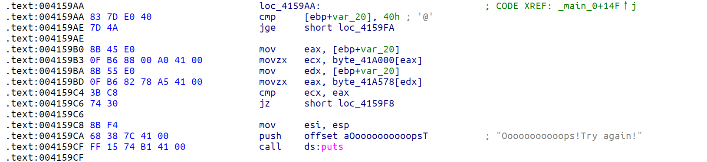


```c
#include<iostream>
#include<stdlib.h>
#include<string.h>
using namespace std;
#pragma warning(disable:4996)

char key1[16] = "DX3906";
char key2[16] = "doctor3";
char key3[16] = "FUX1AOYUN";
char key4[16] = "R3verier";
char* keys[4] = { key1, key2, key3, key4 };

char str1[] = { 90, 227, 107, 228, 6, 135, 2, 79, 67, 223, 205, 193, 119, 152, 107, 219, 143, 56, 67, 153, 227, 147, 34, 181, 35, 253, 176, 28, 229, 227, 238, 206, 47, 29, 173, 43, 164, 21, 152, 249, 216, 235, 37, 250, 107, 33, 183, 114, 185, 3, 51, 46, 217, 76, 235, 123, 245, 167, 72, 249, 144, 157, 56, 252, 0 };
int delta = 0x9E3779B9;

void decryt(int pos, int* key) {
	char* p = str1 + 8 * pos;
	unsigned int x = *((int* )p);
	unsigned int y = *((int* )(p + 4));
	unsigned int sum = (delta << 5);
	for (int i = 0; i < 32; i++) {
		y -= (key[3] + (x >> 5)) ^ (sum + x) ^ (key[2] + (x << 4));
		x -= (key[1] + (y >> 5)) ^ (sum + y) ^ (key[0] + (y << 4));
		sum -= delta;
	}
	*((int*)p) = x;
	*((int*)(p + 4)) = y;
}

int main()
{
	for (int i = 0; i < 8; i++)
		decryt(i, (int*)keys[i % 4]);
	for (int i = 4; i < 8; i++)
		decryt(i, (int*)keys[i % 4]);
	printf("%s\n", str1);
	system("pause");
	return 0;

}
```

