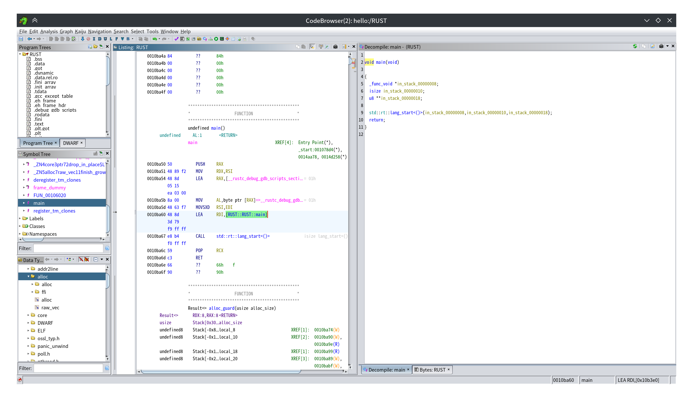

这题是用ghidra来说十分困难的一题，但我仍然坚守住了自由软件的阵地（）

[GhidRust](https://github.com/DMaroo/GhidRust/) 十分原始，并不是很有用，可以加载附带的 [Function ID database](https://github.com/DMaroo/GhidRust/blob/master/data/libstd-4c74cbab78ec4891.fidb)，但是对本题用处不大

由于 Rust 内部并没有被很好的文档说明，所以这题其实看汇编更加简单

这是反编译后的main函数，那么用户代码在哪呢


对了，在这（


显然这边是在分配一个应当是String的玩意


捕捉关键词xor，左边找到操作数0x88，异或完就得到flag


```python
In [1]: puVar3=[0]*0x1e

In [2]: puVar3=bytearray([0]*0x1e)

   ...:     puVar3[2] = 0xed;
   ...:     puVar3[3] = 0xeb;
   ...:     puVar3[4] = 0xfc;
   ...:     puVar3[5] = 0xee;
   ...:     puVar3[6] = 0xf3;
   ...:     puVar3[7] = 0xda;
   ...:     puVar3[8] = 0xfd;
   ...:     puVar3[9] = 0xfb;
   ...:     puVar3[10] = 0xfc;
   ...:     puVar3[0xb] = 0xd7;
   ...:     puVar3[0xc] = 0xfa;
   ...:     puVar3[0xd] = 0xed;
   ...:     puVar3[0xe] = 0xfe;
   ...:     puVar3[0xf] = 0xd7;
   ...:     puVar3[0x10] = 0xff;
   ...:     puVar3[0x11] = 0xe1;
   ...:     puVar3[0x12] = 0xe4;
   ...:     puVar3[0x13] = 0xe4;
   ...:     puVar3[0x14] = 0xd7;
   ...:     puVar3[0x15] = 0xea;
   ...:     puVar3[0x16] = 0xed;
   ...:     puVar3[0x17] = 0xd7;
   ...:     puVar3[0x18] = 0xe9;
   ...:     puVar3[0x19] = 0xff;
   ...:     puVar3[0x1a] = 0xee;
   ...:     puVar3[0x1b] = 0xfd;
   ...:     puVar3[0x1c] = 0xb9;
   ...:     puVar3[0x1d] = 0xf5;

In [5]: bytes(map(lambda x:x^0x88,puVar3))
Out[5]: b'moectf{Rust_rev_will_be_awfu1}'

```