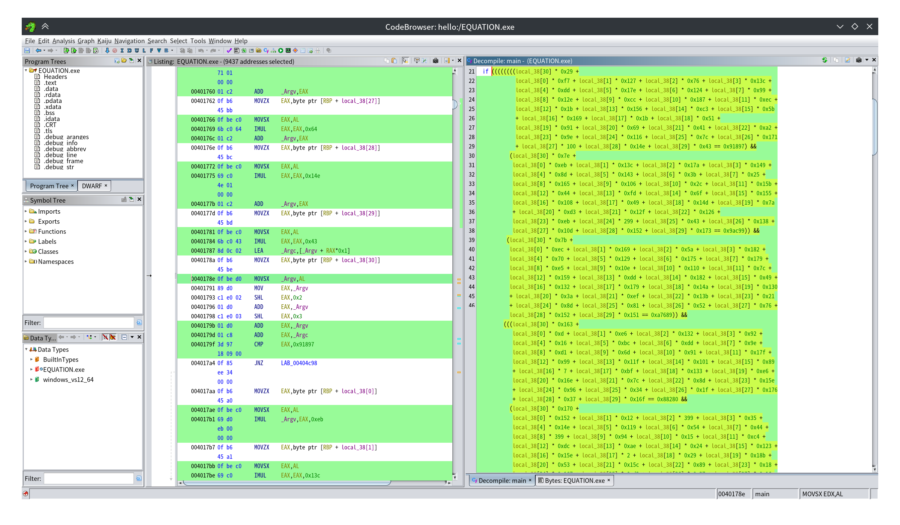

z3
```python
from z3 import *
flag = []
for i in range(31):
    flag.append(z3.Int("flag[%d]" % i))
S = Solver()
S.add((flag[30] * 0x29 +
       flag[0] * 0xf7 + flag[1] * 0x127 + flag[2] * 0x76 + flag[3] * 0x13c +
       flag[4] * 0xdd + flag[5] * 0x17e + flag[6] * 0x124 + flag[7] * 0x99 +
       flag[8] * 0x12e + flag[9] * 0xcc + flag[10] * 0x187 + flag[11] * 0xec +
       flag[12] * 0x1b + flag[13] * 0x156 + flag[14] * 0xc3 + flag[15] * 0x5b
       + flag[16] * 0x169 + flag[17] * 0x1b + flag[18] * 0x51 +
       flag[19] * 0x91 + flag[20] * 0x69 + flag[21] * 0x41 + flag[22] * 0xa2 +
       flag[23] * 0x9e + flag[24] * 0x116 + flag[25] * 0x7c + flag[26] * 0x171
       + flag[27] * 100 + flag[28] * 0x14e + flag[29] * 0x43 == 0x91897),
      (flag[30] * 0x7e +
       flag[0] * 0xeb + flag[1] * 0x13c + flag[2] * 0x17a + flag[3] * 0x149 +
       flag[4] * 0x8d + flag[5] * 0x143 + flag[6] * 0x3b + flag[7] * 0x25 +
       flag[8] * 0x165 + flag[9] * 0x106 + flag[10] * 0x2c + flag[11] * 0x15b +
       flag[12] * 0x44 + flag[13] * 0xfd + flag[14] * 0x6f + flag[15] * 0x155 +
       flag[16] * 0x108 + flag[17] * 0x49 + flag[18] * 0x14d + flag[19] * 0x7a
       + flag[20] * 0xd3 + flag[21] * 0x12f + flag[22] * 0x126 +
       flag[23] * 0xeb + flag[24] * 299 + flag[25] * 0x43 + flag[26] * 0x138 +
       flag[27] * 0x10d + flag[28] * 0x152 + flag[29] * 0x173 == 0x9ac99),
      (flag[30] * 0x7b +
       flag[0] * 0xec + flag[1] * 0x169 + flag[2] * 0x5a + flag[3] * 0x182 +
       flag[4] * 0x70 + flag[5] * 0x129 + flag[6] * 0x175 + flag[7] * 0x179 +
       flag[8] * 0xe5 + flag[9] * 0x10e + flag[10] * 0x110 + flag[11] * 0x7c +
       flag[12] * 0x159 + flag[13] * 0xdd + flag[14] * 0x182 + flag[15] * 0x49 +
       flag[16] * 0x132 + flag[17] * 0x179 +
       flag[18] * 0x14a + flag[19] * 0x130
       + flag[20] * 0x3a + flag[21] * 0xef + flag[22] * 0x13b + flag[23] * 0x21
       + flag[24] * 0x8d + flag[25] * 0x81 + flag[26] * 0x52 + flag[27] * 0x76 +
       flag[28] * 0x152 + flag[29] * 0x151 == 0xa7689),
      (flag[30] * 0x163 +
       flag[0] * 0xd + flag[1] * 0xe6 + flag[2] * 0x132 + flag[3] * 0x92 +
       flag[4] * 0x16 + flag[5] * 0xbc + flag[6] * 0xdd + flag[7] * 0x9e +
       flag[8] * 0xd1 + flag[9] * 0x6d + flag[10] * 0x91 + flag[11] * 0x17f +
       flag[12] * 0x99 + flag[13] * 0x11f + flag[14] * 0x101 + flag[15] * 0x89
       + flag[16] * 7 + flag[17] * 0xbf + flag[18] * 0x133 + flag[19] * 0xe6 +
       flag[20] * 0x16e + flag[21] * 0x7c + flag[22] * 0x8d + flag[23] * 0x15e
       + flag[24] * 0x96 + flag[25] * 0x34 + flag[26] * 0x1f + flag[27] * 0x176
       + flag[28] * 0x37 + flag[29] * 0x16f == 0x88280),
      (flag[30] * 0x170 +
       flag[0] * 0x152 + flag[1] * 0x12 + flag[2] * 399 + flag[3] * 0x35 +
       flag[4] * 0x14e + flag[5] * 0x119 + flag[6] * 0x54 + flag[7] * 0x44 +
       flag[8] * 399 + flag[9] * 0x94 + flag[10] * 0x15 + flag[11] * 0xc4 +
       flag[12] * 0xdc + flag[13] * 0xae + flag[14] * 0x24 + flag[15] * 0x123 +
       flag[16] * 0x15e + flag[17] * 2 + flag[18] * 0x29 + flag[19] * 0x18b +
       flag[20] * 0x53 + flag[21] * 0x15c + flag[22] * 0x89 + flag[23] * 0x18 +
       flag[24] * 0x167 + flag[25] * 0xd2 + flag[26] * 0x37 + flag[27] * 0x16a
       + flag[28] * 0xbf + flag[29] * 100 == 0x837a7),
      (flag[30] * 100 +
       flag[0] * 0x18b + flag[1] * 0x12e + flag[2] * 0xbd + flag[3] * 0xd1 +
       flag[4] * 0xf4 + flag[5] * 0xd0 + flag[6] * 0xe0 + flag[7] * 0x12f +
       flag[8] * 0x18e + flag[9] * 0x164 + flag[10] * 0x77 + flag[11] * 0x31 +
       flag[12] * 200 + flag[13] * 0xfb + flag[14] * 0x87 + flag[15] * 0x10 +
       flag[16] * 0x135 + flag[17] * 0x13a + flag[18] * 0xd + flag[19] * 0xd9 +
       flag[20] * 0x136 + flag[21] * 0x15 + flag[22] * 0xcf + flag[23] * 0x53 +
       flag[24] * 0xf8 + flag[25] * 0x5d + flag[26] * 0x80 + flag[27] * 0x43 +
       flag[28] * 0x7f + flag[29] * 0xbc == 0x8db20),
      (flag[30] * 0x55 +
       flag[0] * 0x58 + flag[1] * 0xd7 + flag[2] * 0xbf + flag[3] * 0x166 +
       flag[4] * 0x39 + flag[5] * 0xbe + flag[6] * 0xb3 + flag[7] * 0x26 +
       flag[8] * 0x124 + flag[9] * 0x8a + flag[10] * 0x16 + flag[11] * 0x48 +
       flag[12] * 0x165 + flag[13] * 9 + flag[14] * 0x18e + flag[15] * 0x185 +
       flag[16] * 0x51 + flag[17] * 0x18e + flag[18] * 0xc4 + flag[19] * 0xb4
       + flag[20] * 0xda + flag[21] * 0x102 + flag[23] * 0xf8 +
       flag[24] * 0x12f + flag[25] * 0x72 + flag[26] * 0x183 + flag[27] * 0x7b
       + flag[28] * 0x157 + flag[29] * 0x125 == 0x815b7),
      (flag[30] * 0x164 +
       flag[0] * 0xcb + flag[1] * 0x6e + flag[2] * 200 + flag[3] * 0x138 +
       flag[4] * 0x113 + flag[5] * 0x185 + flag[6] * 0x124 + flag[7] * 0x4c +
       flag[8] * 0x165 + flag[9] * 99 + flag[10] * 0x15 + flag[11] * 0xfb +
       flag[12] * 0x142 + flag[13] * 0x18e + flag[14] * 0x119 +
       flag[15] * 0xd8 + flag[16] * 0xf4 + flag[17] * 0x8e + flag[18] * 0x10d
       + flag[19] * 0x21 + flag[20] * 0x4b + flag[21] * 0x56 +
       flag[22] * 0x16a + flag[23] * 0xf6 + flag[24] * 0x148 + flag[25] * 0x37
       + flag[26] * 0x110 + flag[27] * 0xea + flag[28] * 0xca +
       flag[29] * 0x137 == 0x9a364),
      (flag[30] * 0x45 +
       flag[0] * 0x138 + flag[1] * 0xf1 + flag[2] * 0x95 + flag[3] * 0xea +
       flag[4] * 0x9b + flag[5] * 0xe1 + flag[6] * 0x124 + flag[7] * 0x170 +
       flag[8] * 0x81 + flag[9] * 0x178 + flag[10] * 0x185 + flag[11] * 0x79 +
       flag[12] * 0x9a + flag[13] * 0xa9 + flag[14] * 0x84 + flag[15] * 0xe8 +
       flag[16] * 0x9d + flag[17] * 0xd9 + flag[18] * 0xe2 + flag[19] * 0x120 +
       flag[20] * 0x11d + flag[21] * 0xb6 + flag[22] * 0xb9 + flag[23] * 0xca +
       flag[24] * 0x17 + flag[25] * 0x37 + flag[26] * 0xbd + flag[27] * 0xc9 +
       flag[28] * 0x120 + flag[29] * 0x105 == 0x961b8),
      (flag[30] * 0x91 +
       flag[0] * 0x139 + flag[1] * 0x107 + flag[2] * 0xba + flag[3] * 0x10f +
       flag[4] * 0x74 + flag[5] * 0x65 + flag[6] * 0x72 + flag[7] * 0x86 +
       flag[8] * 0x37 + flag[9] * 0x11a + flag[10] * 0x58 + flag[11] * 0x69 +
       flag[12] * 0x11e + flag[13] * 0x10 + flag[14] * 0x61 + flag[15] * 0x18b +
       flag[16] * 0xc1 + flag[17] * 0x95 + flag[18] * 0x10a + flag[19] * 0xed +
       flag[20] * 0x95 + flag[21] * 0x81 + flag[22] * 0x11f + flag[23] * 0x18c +
       flag[24] * 0x117 + flag[25] * 0x17 + flag[26] * 0x8b + flag[27] * 0x99 +
       flag[28] * 0x76 + flag[29] * 0x3c == 0x7c9be),
      (flag[30] * 0x163 +
       flag[0] * 0x136 + flag[1] * 0x9a + flag[2] * 0x18 + flag[3] * 0x35 +
       flag[4] * 0x27 + flag[5] * 0x124 + flag[6] * 0x3b + flag[7] * 0x2c +
       flag[8] * 0x42 + flag[9] * 0x175 + flag[10] * 0x32 + flag[11] * 0x14f +
       flag[12] * 0xa1 + flag[13] * 0x149 + flag[14] * 0xde + flag[15] * 0x18c +
       flag[16] * 0x90 + flag[17] * 0x51 + flag[18] * 0x17e + flag[19] * 0x2e +
       flag[20] * 0x166 + flag[21] * 0x141 + flag[22] * 0x9c + flag[23] * 0x139 +
       flag[24] * 0x91 + flag[25] * 0xe8 + flag[26] * 8 + flag[27] * 0x70 +
       flag[28] * 0x35 + flag[29] * 0x181 == 0x88694),
      (flag[30] * 0x159 +
       flag[0] * 0xa3 + flag[1] * 0x10e + flag[2] * 0xad + flag[3] * 0xb1 +
       flag[4] * 0x13e + flag[5] * 0x129 + flag[6] * 0x11f + flag[7] * 0x46 +
       flag[8] * 0xe9 + flag[9] * 0x9f + flag[10] * 0x174 + flag[11] * 0x112 +
       flag[12] * 0x86 + flag[13] * 0xe0 + flag[14] * 0x72 + flag[15] * 0xe +
       flag[16] * 0x4d + flag[17] * 0x19 + flag[18] * 0xca + flag[19] * 0xbf +
       flag[20] * 0x166 + flag[21] * 0x131 + flag[22] * 0x183 + flag[23] * 0x12 +
       flag[24] * 0xa8 + flag[25] * 0x16 + flag[26] * 0x4a + flag[27] * 0x139 +
       flag[28] * 0x182 + flag[29] * 0xf9 == 0x909ed),
      (flag[30] * 0x10c +
       flag[0] * 0x168 + flag[1] * 0x183 + flag[2] * 300 + flag[3] * 0x108 +
       flag[4] * 0x56 + flag[5] * 0x16 + flag[6] * 0x8e + flag[7] * 0x5c +
       flag[8] * 0xe7 + flag[9] * 0x145 + flag[10] * 0x189 + flag[11] * 0x131 +
       flag[12] * 0xe8 + flag[13] * 0xcb + flag[14] * 0xb5 + flag[15] * 0x105 +
       flag[16] * 0x174 + flag[17] * 0xdf + flag[18] * 0x144 + flag[19] * 0x157 +
       flag[20] * 0xe1 + flag[21] * 0x7f + flag[22] * 99 + flag[23] * 2 +
       flag[24] * 0x1b + flag[25] * 0xd + flag[26] * 0x50 + flag[27] * 0x12e +
       flag[28] * 0x181 + flag[29] * 0x188 == 0x97436),
      (flag[30] * 0xd +
       flag[0] * 0x13f + flag[1] * 0x40 + flag[2] * 0xda + flag[3] * 0x11c +
       flag[4] * 0xfb + flag[5] * 0xc1 + flag[6] * 0x116 + flag[7] * 0x42 +
       flag[8] * 0xab + flag[9] * 0x12e + flag[10] * 0x102 + flag[11] * 0x5e +
       flag[12] * 0xb0 + flag[13] * 0x7d + flag[14] * 0x13 + flag[15] * 0x18 +
       flag[16] * 0x127 + flag[17] * 0x5e + flag[18] * 0x8c + flag[19] * 0x96 +
       flag[20] * 0x55 + flag[21] * 0x10b + flag[22] * 0x60 + flag[23] * 0xa0 +
       flag[24] * 0x6f + flag[25] * 0x21 + flag[26] * 0xeb + flag[27] * 0x172 +
       flag[28] * 0x10e + flag[29] * 0xae == 0x7552d),
      (flag[30] * 0x160 +
       flag[0] * 0xc4 + flag[1] * 0x7b + flag[2] * 0xa2 + flag[3] * 0x66 +
       flag[4] * 0x78 + flag[5] * 0xdf + flag[6] * 0x148 + flag[7] * 0x1d +
       flag[8] * 0x1b + flag[9] * 0xe1 + flag[10] * 0x4a + flag[11] * 0x179 +
       flag[12] * 0x11f + flag[13] * 0x16d + flag[14] * 0x11e + flag[15] * 0x11a +
       flag[16] * 0x135 + flag[17] * 0x16c + flag[18] * 0x166 + flag[19] * 0x2b +
       flag[20] * 0xe3 + flag[21] * 0x178 + flag[22] * 0x13b + flag[23] * 0xaa +
       flag[24] * 0x165 + flag[25] * 0xd2 + flag[26] * 0x146 + flag[27] * 0x104 +
       flag[28] * 0x57 == 0xa2d57),
      (flag[30] * 0x89 +
       flag[0] * 0x115 + flag[1] * 0xcf + flag[2] * 0x16d + flag[3] * 0x17a +
       flag[4] * 0x9e + flag[5] * 0x71 + flag[6] * 100 + flag[7] * 0xe5 +
       flag[8] * 0x106 + flag[9] * 0x33 + flag[10] * 0x8c + flag[11] * 0xa3 +
       flag[12] * 0xbc + flag[13] * 0x7c + flag[14] * 0xbe + flag[15] * 0x140 +
       flag[16] * 0x161 + flag[17] * 0x15b + flag[18] * 0xb + flag[19] * 0x173 +
       flag[20] * 0xd3 + flag[21] * 0x146 + flag[22] * 0xe6 + flag[23] * 0x74 +
       flag[24] * 0xca + flag[25] * 0x104 + flag[26] * 0x40 + flag[27] * 0x7d +
       flag[28] * 0xc3 + flag[29] * 0x3d == 0x902c6),
      (flag[29] * 0x3a +
       flag[0] * 0x9d + flag[1] * 0x1a + flag[2] * 0x10 + flag[3] * 0x9c +
       flag[4] * 0x55 + flag[5] * 0x17 + flag[6] * 0x96 + flag[7] * 0x48 +
       flag[8] * 0x164 + flag[9] * 0x23 + flag[10] * 0x130 + flag[11] * 0x137 +
       flag[12] * 0x8c + flag[13] * 0xcd + flag[14] * 0xb8 + flag[15] * 0xc1 +
       flag[16] * 0x1c + flag[17] * 0x3c + flag[18] * 0x32 + flag[19] * 0xc9 +
       flag[20] * 0x57 + flag[21] * 0x139 + flag[22] * 0x134 + flag[23] * 0x4d +
       flag[24] * 0x144 + flag[25] * 0x9d + flag[26] * 0x168 + flag[27] * 0x12f +
       flag[28] * 0x27 == 0x68c34),
      (flag[30] * 0x7e +
       flag[0] * 0x84 + flag[1] * 0x171 + flag[2] * 0x101 + flag[3] * 0xac +
       flag[4] * 0xfe + flag[5] * 0x86 + flag[6] * 0x180 + flag[7] * 0xa2 +
       flag[8] * 0x35 + flag[9] * 0xff + flag[10] * 0x128 + flag[11] * 0x84 +
       flag[12] * 0x9f + flag[13] * 0xa5 + flag[14] * 0xe5 +
       flag[15] + flag[15] * 0x80 + flag[16] * 0x17 + flag[17] * 0x29 +
       flag[18] * 0x181 + flag[19] * 0x128 + flag[20] * 0x13d + flag[21] * 0x70 +
       flag[22] * 0x11 + flag[23] * 0xde + flag[24] * 0x60 + flag[25] * 0xa1 +
       flag[26] * 0x10d + flag[27] * 0x47 + flag[28] * 0x89 + flag[29] * 0x9d ==
       0x89941),
      (flag[30] * 0xa3 +
       flag[0] * 0x86 + flag[1] * 0x25 + flag[2] * 0x14e + flag[3] * 0xc1 +
       flag[4] * 0x12d + flag[5] * 0x117 + flag[6] * 0xc6 + flag[7] * 0xfa +
       flag[8] * 0xb7 + flag[9] * 5 + flag[10] * 0x14e + flag[11] * 0x1a +
       flag[12] * 0x10e + flag[13] * 0x15 + flag[14] * 0xe1 + flag[15] * 0x103
       + flag[16] * 0xaf + flag[17] * 0x155 + flag[18] * 0x6f + flag[19] * 0x9a
       + flag[20] * 0x8e + flag[21] * 0xdf + flag[22] * 0x8a + flag[23] * 0x113
       + flag[24] * 0x30 + flag[25] * 0x43 + flag[26] * 0x23 + flag[27] * 0x6f
       + flag[28] * 0x53 + flag[29] * 0xcf == 0x789af),
      (flag[30] * 0x164 +
       flag[0] * 0x70 + flag[1] * 0x84 + flag[2] * 0xd9 + flag[3] * 0xd2 +
       flag[4] * 0x12 + flag[5] * 0x48 + flag[6] * 0x4b + flag[7] * 0x71 +
       flag[8] * 0x28 + flag[9] * 0x111 + flag[10] * 0x128 + flag[11] * 0x2b +
       flag[12] * 0x98 + flag[13] * 0x116 + flag[14] * 0x18 + flag[15] * 0x4d +
       flag[16] * 0xb + flag[17] * 0x106 + flag[18] * 0x156 + flag[19] * 0x37 +
       flag[20] * 0xff + flag[21] * 0xf1 + flag[22] * 0xd + flag[23] * 300 +
       flag[24] * 0x119 + flag[25] * 0x94 + flag[26] * 0xa2 + flag[27] * 0x69 +
       flag[28] * 0xb0 + flag[29] * 0x189 == 0x72c31),
      (flag[30] * 0x127 +
       flag[0] * 0x164 + flag[1] * 0x15d + flag[2] * 0x18d + flag[3] * 0x5c +
       flag[4] * 0xd0 + flag[5] * 0xaf + flag[6] * 0xe5 + flag[7] * 0x67 +
       flag[8] * 0xb5 + flag[9] * 0x40 + flag[10] * 5 + flag[11] * 0x188 +
       flag[12] * 0x167 + flag[13] * 0x14f + flag[14] * 0x3a + flag[15] * 0x2c +
       flag[16] * 0x154 + flag[17] * 0xfb + flag[18] * 0x72 + flag[19] * 0x99 +
       flag[20] * 0x159 + flag[21] * 0x186 + flag[22] * 0xbd + flag[23] * 0x129
       + flag[24] * 0x122 + flag[25] * 0x11d +
       flag[26] * 0x58 + flag[27] * 0x28
       + flag[28] * 0xe7 + flag[29] * 0x171 == 0xa171c),
      (flag[30] * 0x169 +
       flag[0] * 0x15 + flag[1] * 0x67 + flag[2] * 0xcc + flag[3] * 0xf7 +
       flag[4] * 0x11f + flag[5] * 0xaa + flag[6] * 0x12a + flag[7] * 0x182 +
       flag[8] * 0x4b + flag[9] * 0x54 + flag[10] * 0x1b + flag[11] * 0x1c +
       flag[12] * 0x10e + flag[13] * 0x9f + flag[14] * 0xc0 + flag[15] +
       flag[16] * 0xe0 + flag[17] * 0x188 + flag[18] * 0xd5 + flag[19] * 0x11b +
       flag[20] * 0xd7 + flag[21] * 0x4d + flag[22] * 0xc9 + flag[23] * 0x176 +
       flag[24] * 0xd5 + flag[25] * 0x28 + flag[26] * 0x81 + flag[27] * 0x155 +
       flag[28] * 0x43 + flag[29] * 3 + flag[29] * 0x18 == 0x87918),
      (flag[30] * 0x107 +
       flag[0] * 0x138 + flag[1] * 0x159 + flag[2] * 0x113 + flag[3] * 0x71 +
       flag[4] * 0x108 + flag[5] * 0xab + flag[6] * 0x30 + flag[7] * 0x180 +
       flag[8] * 0x2f + flag[9] * 0x12a + flag[10] * 0xde + flag[11] * 0x12f +
       flag[12] * 0x153 + flag[13] * 0xaf + flag[14] * 5 + flag[15] * 0x15e +
       flag[16] * 0x20 + flag[17] * 0xda + flag[18] * 0x130 + flag[19] * 0x187 +
       flag[20] * 0x71 + flag[21] * 0x13 + flag[22] * 0x156 + flag[23] * 0xa4 +
       flag[24] * 0xf0 + flag[25] * 0x121 + flag[26] * 0xab + flag[27] * 0xd2 +
       flag[28] * 0x16b + flag[29] * 0x6a == 0x9bad2),
      (flag[30] * 0x15a +
       flag[0] * 0x1c + flag[1] * 0x16d + flag[2] * 0xf + flag[3] * 0xa9 +
       flag[5] * 0x147 + flag[6] * 0x17 + flag[7] * 0x12f + flag[8] * 0x12d +
       flag[9] * 0xa3 + flag[10] * 0xaa + flag[11] * 0x11f + flag[12] * 0x160 +
       flag[13] * 0x48 + flag[14] * 0x14c + flag[15] * 0x143 + flag[16] +
       flag[17] * 0x10e + flag[18] * 0x13e + flag[19] * 0x134 + flag[20] * 0x2d +
       flag[21] * 0x8c + flag[22] * 0x41 + flag[23] * 0x158 + flag[24] * 0x121 +
       flag[25] * 0x181 + flag[26] * 0x77 + flag[27] * 0x3e + flag[28] * 0xa9 +
       flag[29] * 0x116 == 0x8bcc1),
      (flag[30] * 0x157 +
       flag[0] * 0xee + flag[1] * 0x181 + flag[2] * 0xe2 + flag[3] * 0x23 +
       flag[4] * 0x17f + flag[5] * 0x88 + flag[6] * 0x10b + flag[7] * 0x15c +
       flag[8] * 0x14 + flag[9] * 0xe6 + flag[10] * 0x2b + flag[11] * 0x15d +
       flag[12] * 0x122 + flag[13] * 0x92 + flag[14] * 0x58 + flag[15] * 0x162 +
       flag[16] * 0x9e + flag[17] * 0x15 + flag[18] * 0x3c + flag[19] * 0xd0 +
       flag[20] * 0x8e + flag[21] * 0x184 + flag[22] * 0x119 + flag[23] * 0xf9 +
       flag[24] * 0x3f + flag[25] * 9 + flag[26] * 0xed + flag[27] * 0x8f +
       flag[28] * 0x58 + flag[29] * 0x93 == 0x93559),
      (flag[30] * 0xfd +
       flag[0] * 0xad + flag[1] * 0xce + flag[2] * 0x1a + flag[3] * 0x110 +
       flag[4] * 0x15c + flag[5] * 0x18c + flag[6] * 0x8e + flag[7] * 0x139 +
       flag[8] * 0x4b + flag[9] * 0x8e + flag[10] * 0x16c + flag[11] * 0x13b +
       flag[12] * 0xb8 + flag[13] * 0x128 + flag[14] * 0x95 + flag[15] * 0xc9 +
       flag[16] * 0x163 + flag[17] * 0xe1 + flag[18] * 0xd3 + flag[19] * 0x146 +
       flag[20] * 0x76 + flag[21] * 0x9b + flag[22] * 0x90 + flag[23] * 0x16e +
       flag[24] * 0x101 + flag[25] * 0x9f + flag[26] * 0x143 + flag[27] * 0x94 +
       flag[28] * 0x18 + flag[29] * 0x1d == 0xa23b8),
      (flag[30] * 0x1d +
       flag[0] * 0x22 + flag[1] * 0x3e + flag[2] * 0x32 + flag[3] * 0x5a +
       flag[4] * 0xba + flag[5] * 0xed + flag[6] * 0xb + flag[7] * 0xe1 +
       flag[8] * 0xf1 + flag[9] * 0xe6 + flag[10] * 0x14b + flag[11] * 0xd7 +
       flag[12] * 0x9b + flag[13] * 0x52 + flag[14] * 0x26 + flag[15] * 0x150 +
       flag[16] * 0xfc + flag[17] * 0x100 + flag[18] * 0x18a + flag[19] * 0xe +
       flag[20] * 0x155 + flag[21] * 0x150 + flag[22] * 0x24 + flag[23] * 0xa5 +
       flag[24] * 0x5d + flag[25] * 0xaf + flag[26] * 0xd4 + flag[27] * 0xe2 +
       flag[28] * 0x131 + flag[29] * 4 == 0x73804),
      (flag[30] * 0x5d +
       flag[0] * 0x66 + flag[1] * 0x6d + flag[2] * 0x2b + flag[3] * 0x4c +
       flag[4] * 0x12f + flag[5] * 0x40 + flag[6] * 0xa1 + flag[7] * 0x9b +
       flag[8] * 0x32 + flag[9] * 0x3a + flag[10] * 0x76 + flag[11] * 0x118 +
       flag[13] * 0x1c + flag[14] * 0x135 + flag[15] * 0xd5 + flag[16] * 0x13d +
       flag[17] * 0x144 + flag[18] * 0x94 + flag[19] * 0x100 + flag[20] * 0x12f +
       flag[21] * 0xea + flag[22] * 0x12f + flag[23] * 0xfe + flag[24] * 0xe9 +
       flag[25] * 0x3e + flag[26] * 8 + flag[27] * 0xfc + flag[28] * 0xd8 +
       flag[29] * 0x161 == 0x79754),
      (flag[30] * 0x169 +
       flag[0] * 0xea + flag[1] * 0x105 + flag[2] * 10 + flag[3] * 0xed +
       flag[4] * 0x152 + flag[5] * 0x142 + flag[6] * 0x185 + flag[7] * 0x12a +
       flag[8] * 0x71 + flag[9] * 0x11d + flag[10] * 0x188 + flag[11] * 0x68 +
       flag[12] * 0xb5 + flag[13] * 0x159 + flag[14] * 3 + flag[15] * 0x173 +
       flag[16] * 0xdb + flag[17] * 0xd0 + flag[18] * 0x103 + flag[19] * 0x116 +
       flag[20] * 0xa9 + flag[21] * 0xe7 + flag[22] * 0x7b + flag[23] * 0xca +
       flag[24] * 0xdc + flag[25] * 0x112 + flag[26] * 0x35 + flag[27] * 0x52 +
       flag[28] * 0x94 + flag[29] * 0x59 == 0xa0ecd),
      (flag[30] * 0x6c +
       flag[0] * 0x73 + flag[1] * 0x8d + flag[2] * 0x15f + flag[3] * 0xd7 +
       flag[4] * 0x17c + flag[5] * 0x176 + flag[6] * 0x54 + flag[7] * 0x136 +
       flag[8] * 0x55 + flag[9] * 0x162 + flag[10] * 0x52 + flag[11] * 0x58 +
       flag[12] * 0xd4 + flag[13] * 0xef + flag[14] * 0x14a + flag[15] * 0xd7 +
       flag[16] * 0x9b + flag[17] * 0xd7 + flag[18] * 0x13d + flag[19] * 0x108 +
       flag[20] * 0x173 + flag[21] * 300 + flag[22] * 0x3a + flag[23] * 0x45 +
       flag[24] * 0x89 + flag[25] * 0x45 + flag[26] * 0x13b + flag[27] * 0x5d +
       flag[28] * 0x167 + flag[29] * 0x169 == 0x99983))
print(S.check())
t = S.model()
for i in range(len(flag)):
    print(chr(t[flag[i]].as_long()), end='')
```
`moectf{y0u_s0lv3d_Equati0ns!!!}`