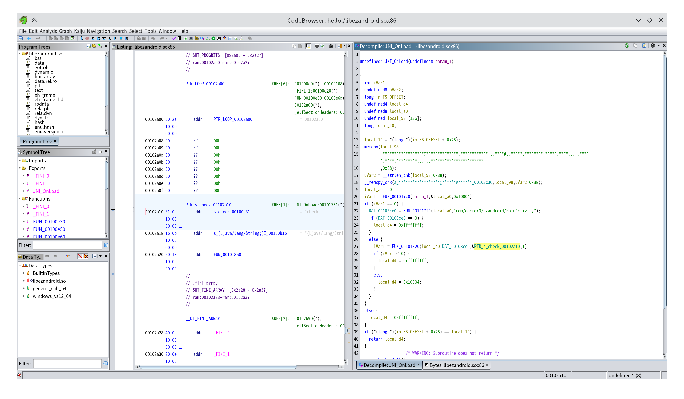

逻辑主要位于原生层，这里用ghidra打开原生层共享库，以x86_64为例

export中未找到对应函数，说明是再JNI_OnLoad中动态注册的


主要逻辑，写一个简单搜索就行，但要注意JNI_OnLoad中更改了s_00103c30字符串


```python
In [1]: a="******************@**************.************...****#..*****.********.*****.****.....*****.****.*********......***********************"


In [5]: def solve(res, c):
   ...:     if len(res) > 23:
   ...:         return None
   ...:     if a[c] == '*':
   ...:         return None
   ...:     elif a[c] == '#':
   ...:         return res
   ...:     for cc, d in (('a', -1), ('d', 1), ('w', -0xf), ('s', 0xf)):
   ...:         r = solve(res+cc, c+d)
   ...:         if r:
   ...:             return r
   ...: 

In [6]: solve('',0x12)
Out[6]: 'ssaassssdddddwwddddwwaa'
```