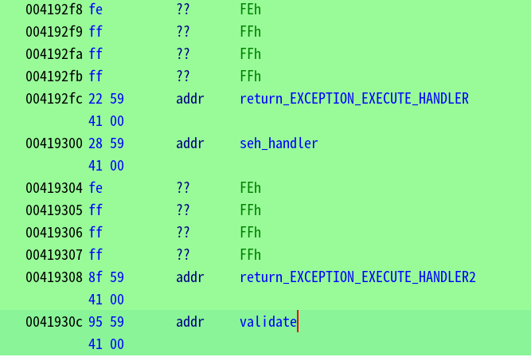
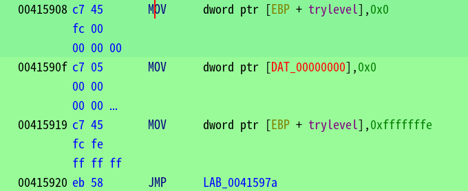
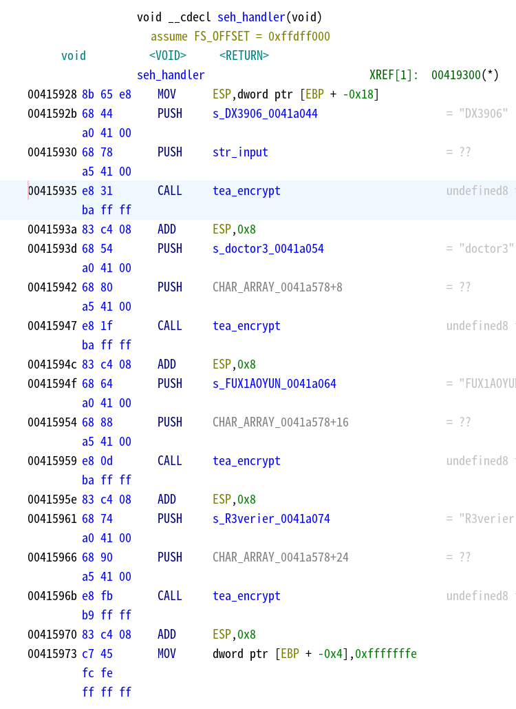
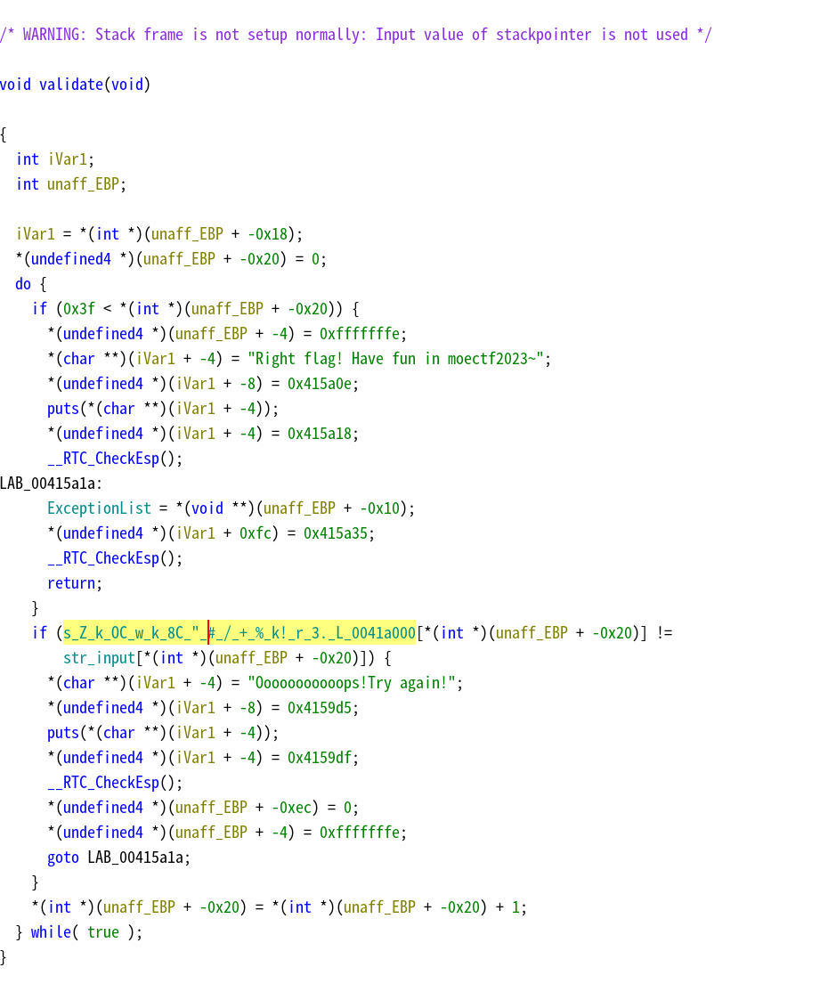
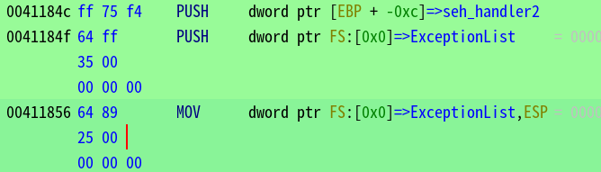
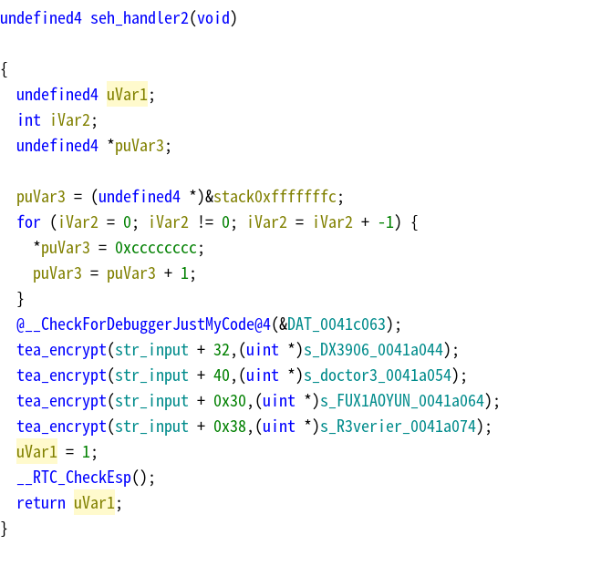

SEH也可以静态分析，推荐几个学习资料
- `[你的VS安装文件夹]\VC\Tools\MSVC\[MSVC版本]\crt\src\i386` 这是巨硬提供给你的CRT的内部实现
- [A Crash Course on the Depths of Win32™ Structured Exception Handling](https://bytepointer.com/resources/pietrek_crash_course_depths_of_win32_seh.htm) 发布于*Microsoft Systems Journal*，比较古老，但是好在短小精悍，基本入门SEH看这个就行，注意部分内容与现在有少量区别
- [Understanding Windows Structured Exception Handling Part 1 – The Basics](https://limbioliong.wordpress.com/2022/01/09/understanding-windows-structured-exception-handling-part-1/) 有4个部分，对上面的文章做了补充与更新

需要用到的结构
```c
/// From winnt.h and chandler4.c, 
/// *
///       Copyright (c) Microsoft Corporation.  All rights reserved.
/// *
typedef struct _EXCEPTION_REGISTRATION_RECORD {
    struct _EXCEPTION_REGISTRATION_RECORD *Next;
    PEXCEPTION_ROUTINE Handler;
} EXCEPTION_REGISTRATION_RECORD;

typedef EXCEPTION_REGISTRATION_RECORD *PEXCEPTION_REGISTRATION_RECORD;

typedef struct _EXCEPTION_POINTERS {
    PEXCEPTION_RECORD ExceptionRecord;
    PCONTEXT ContextRecord;  // CONTEXT对分析不重要，仅仅是保存运行时现场
} EXCEPTION_POINTERS, *PEXCEPTION_POINTERS;

typedef struct _EH4_SCOPETABLE_RECORD
{
    ULONG                           EnclosingLevel;
    PEXCEPTION_FILTER_X86           FilterFunc;
    union
    {
        PEXCEPTION_HANDLER_X86      HandlerAddress;
        PTERMINATION_HANDLER_X86    FinallyFunc;
    } u;
} EH4_SCOPETABLE_RECORD, *PEH4_SCOPETABLE_RECORD;

typedef struct _EH4_SCOPETABLE
{
    ULONG                       GSCookieOffset;
    ULONG                       GSCookieXOROffset;
    ULONG                       EHCookieOffset;
    ULONG                       EHCookieXOROffset;
    EH4_SCOPETABLE_RECORD       ScopeRecord[1];
} EH4_SCOPETABLE, *PEH4_SCOPETABLE;

typedef struct _EH4_EXCEPTION_REGISTRATION_RECORD
{
    PVOID                           SavedESP;
    PEXCEPTION_POINTERS             ExceptionPointers;
    EXCEPTION_REGISTRATION_RECORD   SubRecord;
    UINT_PTR                        EncodedScopeTable;  // 事实上是 PEH4_SCOPETABLE
    ULONG                           TryLevel;
} EH4_EXCEPTION_REGISTRATION_RECORD, *PEH4_EXCEPTION_REGISTRATION_RECORD;
```

这个程序有防调试，动态调试记得NOP掉

看到`__except_handler4`，说明使用了编译器提供的`__try/__except/__finally`机制，所以根据`EH4_EXCEPTION_REGISTRATION_RECORD`结构找到scopetable


下方是两个`EH4_SCOPETABLE_RECORD`，可以看见有两个同级（Enclosing等级均为-2）的记录，trylevel分别为0和1（即表中下标），过滤函数均为返回直接执行


第一次更改trylevel，此处直接引发异常，分析`seh_handler`逻辑，可以看出为四个tea加密，`CHAR_ARRAY_0041a578`为`str_input`同位置（此处栈帧不正常，所以直接分析汇编代码更为清晰）



第二次更改trylevel，并调用函数，此处的异常处理器`validate`为简单的比对输入是否与正确密文相同，加密逻辑不在此处（可得知密文内容和密文长度0x3f）（ghidra又不想分析了，自己脑中处理以下）



分析所调用的函数可以看出，这里手动添加了一个`seh_handler2`到SEH链中，下方INT3引发异常


分析`seh_handler2`，发现是对输入后半段加密，注意返回值为1，即`EXCEPTION_CONTINUE_SEARCH`，所以这个函数会被执行两次，正常搜索一次，找到上层handler（`validate`）后，unwind再一次


写出解密代码
```python
In [1]: from tea import *

In [4]: a=b''.join(map(lambda x: x.encode() if isinstance(x, str) else x, ["Z",b"\xE3","k",b"\xE4",b"\x06",b"\
   ...: x87",b"\x02","OC",b"\xDF",b"\xCD",b"\xC1","w",b"\x98","k",b"\xDB",b"\x8F","8C",b"\x99",b"\xE3",b"\x93"
   ...: ,"\"",b"\xB5","#",b"\xFD",b"\xB0",b"\x1C",b"\xE5",b"\xE3",b"\xEE",b"\xCE","/",b"\x1D",b"\xAD","+",b"\x
   ...: A4",b"\x15",b"\x98",b"\xF9",b"\xD8",b"\xEB","%",b"\xFA","k!",b"\xB7","r",b"\xB9",b"\x03","3.",b"\xD9",
   ...: "L",b"\xEB","{",b"\xF5",b"\xA7","H",b"\xF9",b"\x90",b"\x9D","8",b"\xFC"]))

In [5]: a
Out[5]: b'Z\xe3k\xe4\x06\x87\x02OC\xdf\xcd\xc1w\x98k\xdb\x8f8C\x99\xe3\x93"\xb5#\xfd\xb0\x1c\xe5\xe3\xee\xce/\x1d\xad+\xa4\x15\x98\xf9\xd8\xeb%\xfak!\xb7r\xb9\x033.\xd9L\xeb{\xf5\xa7H\xf9\x90\x9d8\xfc'

In [6]: k=["DX3906", "doctor3", "FUX1AOYUN", "R3verier"]

In [10]: for i in range(8):
    ...:     if i >= 4:
    ...:         print(decrypt(decrypt(a[i*8:(i+1)*8], k[i%4], tea, 1), k[i%4], tea),end='')
    ...:     else:
    ...:         print(decrypt(a[i*8:(i+1)*8], k[i%4], tea),end='')
    ...: 
moectf{WoOo00Oow_S0_interesting_y0U_C4n_C41l_M3tW1c3_BY_Unw1Nd~}

```