# MoeCTF 2023 MISC wp
#### 第一次写wp，不好的地方望海涵
---
## Misc入门指北

指北最后的：bW9lY3Rme2hAdjNfZnVuX0B0X20xNWNfIX0=  
经过base64后解密后得到flag
```
moectf{h@v3_fun_@t_m15c_!}
```

## 打不开的图片1
下载附件后用010Editor打开，发现文件尾FF D9，为jpg文件的文件尾，于是添加文件头FF D8，并添加文件后缀.jpg
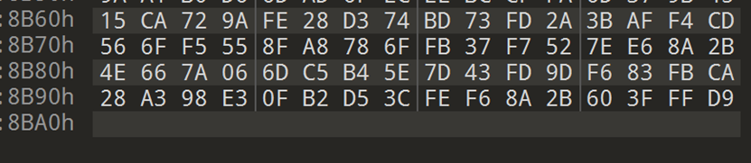
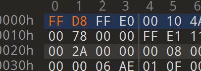

查看图片属性，发现主题里有一个16进制编码的字符串
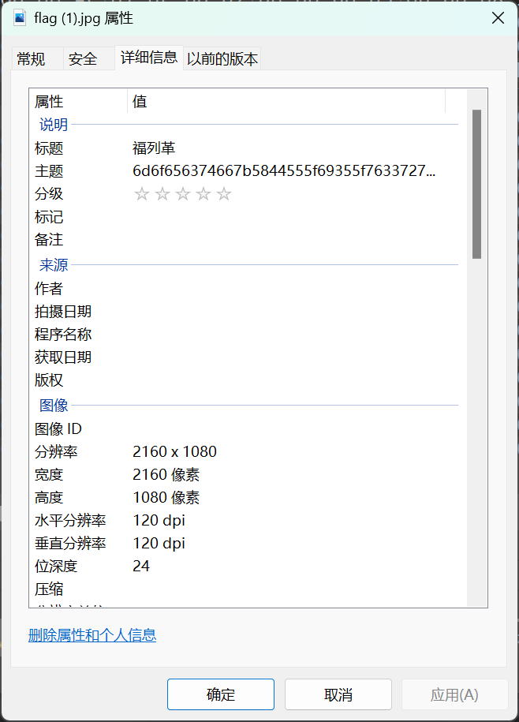
解码后得到flag
```
moectf{XDU_i5_v3ry_6e@u2ifu1}
```

## 打不开的图片2
下载附件后发现图片确实无法打开，用010Editor打开后发现是文件头出错，将文件头改为png文件的文件头89 50 4E 47

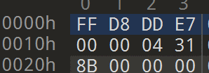

打开图片得到flag
```
moectf{D0_yOu_1ik3_Bo7@k_?}
```

## 狗子(1)普通的猫猫
下载附件后用010Editor打开发现flag就在文件末尾
```
moectf{eeeez_f1ag_as_A_G1ft!}
```

## building_near_lake
下载照片后在信息里找到拍摄设备
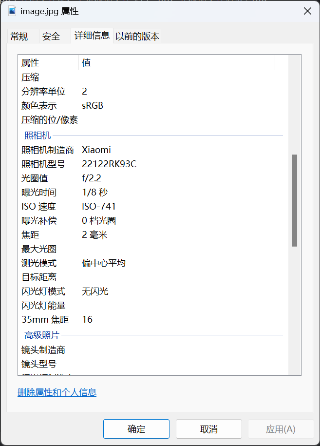
搜索可知发布会时间为2022-12-27，同时通过识图知道图片里是厦门大学翔安校区的德旺图书馆

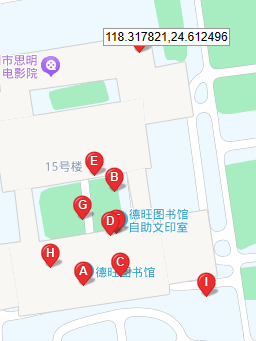

结合图片和地图可以得出照片拍摄的大致位置，在地图里得到经纬度  
回答三个问题得到flag
```
moectf{P0sT_Y0uR_Ph0T0_wiTh_0Riginal_File_is_n0T_a_g00d_idea_YlJf!M3rux}
```

## 尊嘟假嘟
解压附件得到一个奇怪的文本？
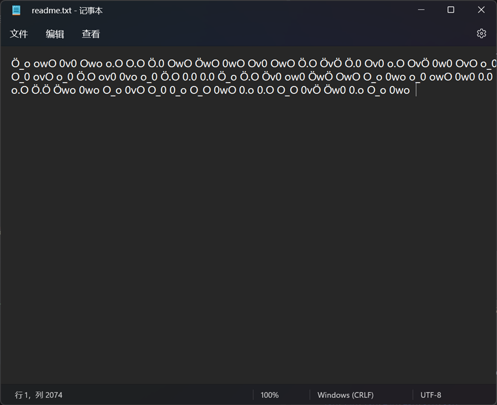
搜索一番后发现居然有尊嘟假嘟语（好好好这么玩是吧）


解密后得到
```
cipher: rY5Ah8BtsYYatLEPu8YCPU22Gr5PQt8YGDKkvb4bk3D4JJeEe5kgCpoEqgRzsM7m9d8jEtE3LUoKpULQnMcuAunU1gtpzC5kSUxFctFTNCMZVHLHZNCo5akzKMRY5bbyBP7RNUeGDEYoUc
key: the tailing 8 bytes of hash of "zundujiadu?" which begin with b6091904cdfb
iv: the end 8 bytes of hash of "dududu?" which begin with 272bf1da2207

hint1: how do Bitcoin addresses encode?
hint2: the name of cryptosystem is "bl****sh"
```


根据要求，了解比特币的编码过程，以及bl开头sh结尾的加密算法是河豚算法

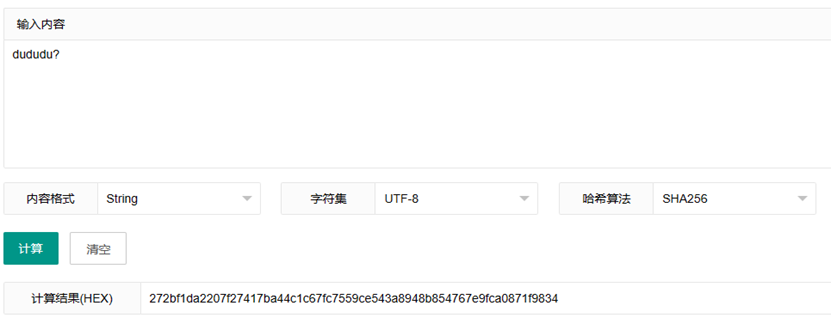
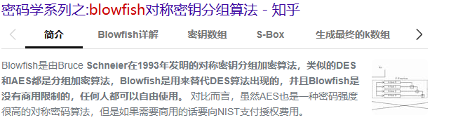
根据要求可以得到key和iv分别为
```
key:57e55c126f1557b3
iv:67e9fca0871f9834
```

根据提示，先对密文用base58check编码，再用河豚解密，最后经过base64解密后得到flag
```
moectf{wow_you_aRe_the_masteR_of_Zundujiadu_92WPIBung92WPIBung9?WPIBung}
```

## 奇怪的压缩包
根据题目描述，用foremost对附件处理得到一个ppt

打开看看是什么
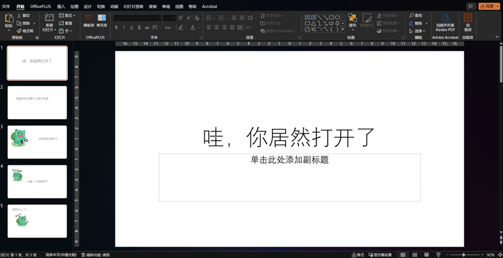

妙蛙种子嘴里的这是？


是一个批注？


根据flag的格式，不难猜想这个批注很可能是flag的一部分，那剩下的部分应该也在ppt里，直接ctrlf搜索一下
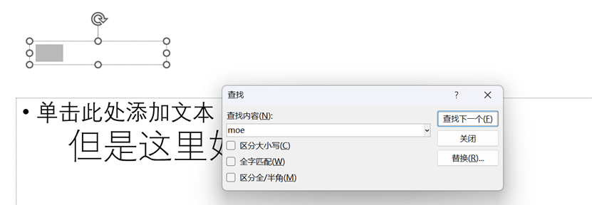
果不其然是藏起来了
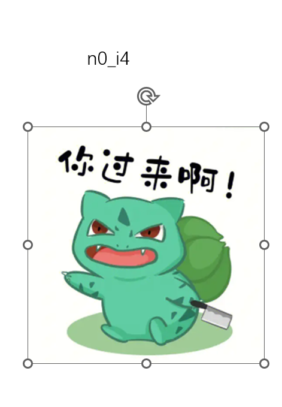

这里还有一个
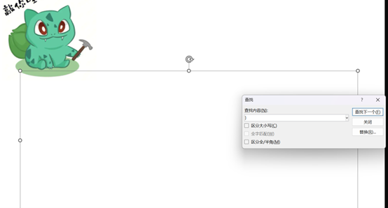

最后一个，全部右键文本框编辑文字，然后ctrlc直接复制即可，全部拼接起来得到flag
```
moectf{2ip_?_n0_i4_pp4x!}
```

## 机位查询
第一张图片里的南宁站很明显，结合图片里的酒店对照地图可以得到第一栋楼是“嘉士摩根国际”
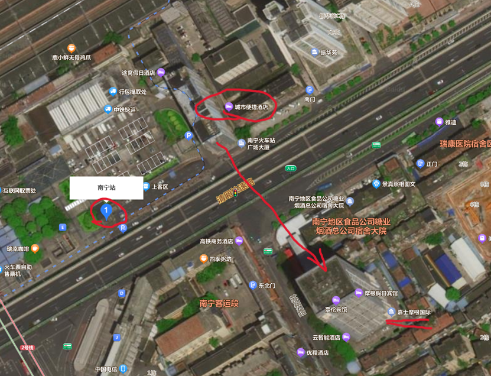
第二张图片里明显是中山路美食街，搜索可以看到周围的店铺，正好图片里正对着这家墨功纹身


结合图片的方向和地图，这个方向上最近的楼在百盛购物中心一块，故应该是“百盛”两字开头的一栋楼
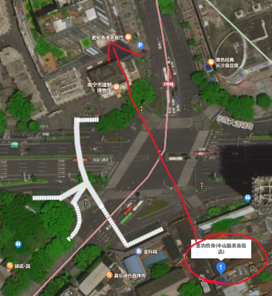

第三张图片gps信息没有隐藏，那我可就直接定位了（狗头）
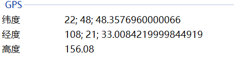
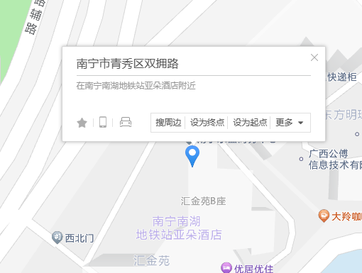

是“汇金苑”，按照题目要求用拼音拼接得到flag
```
moectf{jiashi_baisheng_huijin}
```

## 狗子(3)寝室
将附件解压，发现是压缩套压缩，结合文件名可以知道这是一个套了9999次的压缩包，并且压缩格式还有zip,7z,tar.gz三种
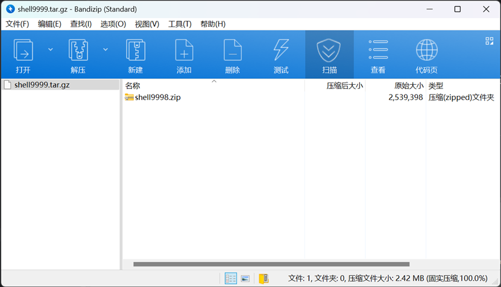
于是编写解压脚本
```Python
import os
import py7zr
import tarfile
import zipfile

def extract_doll_zip(path, dest_directory):
    if path.endswith('.zip'):
        with zipfile.ZipFile(path, 'r') as zip_ref:
            zip_ref.extractall(dest_directory)
    elif path.endswith('.7z'):
        with py7zr.SevenZipFile(path, mode='r') as sevenzip_ref:
            sevenzip_ref.extractall(dest_directory)
    elif path.endswith('.tar.gz') or path.endswith('.tgz') or path.endswith('.tar'):
        with tarfile.open(path, 'r') as tar_ref:
            tar_ref.extractall(dest_directory)

def get_next_doll_name(current_name):
    name_parts = current_name.split('shell')
    doll_number = int(name_parts[1].split('.')[0])
    next_doll_name = None

    # 根据不同的后缀寻找下一个压缩包
    for extension in ['.zip', '.7z', '.tar.gz']:
        possible_next_doll = f"shell{doll_number - 1}{extension}"
        if os.path.exists(os.path.join(directory_path, possible_next_doll)):
            next_doll_name = possible_next_doll
            break

    return next_doll_name

def unpack_nested_dolls(directory_path, initial_doll_name):
    doll_name = initial_doll_name
    while True:
        doll_path = os.path.join(directory_path, doll_name)
        if os.path.exists(doll_path):
            extract_doll_zip(doll_path, directory_path)
            print('已解压文件:', doll_path)
            next_doll_name = get_next_doll_name(doll_name)
            if next_doll_name is None:
                print('全部解压完成！')
                break
            doll_name = next_doll_name
        else:
            print('找不到压缩包:', doll_path)
            break

directory_path = r'这里填文件路径'
initial_doll_name = 'shell9999.tar.gz'

unpack_nested_dolls(directory_path, initial_doll_name)
```
运行后得到flag（我这个解压完后不会把上一级删除，导致解压了将近10个g的文件）
```
moectf{Ca7_s133p1ng_und3r_zip_5hell5}
```

### 没了，就写这么多吧（其实就是太菜了）